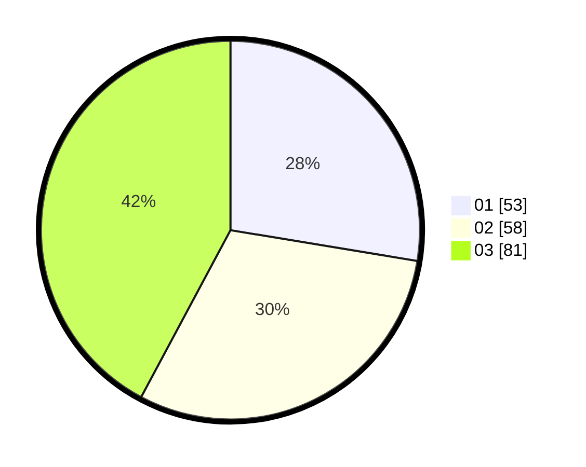

# Hasil

Hasil perolehan suara paslon dapat dilihat pada file paslon-01.txt, paslon-02.txt, dan paslon-03.txt.

Jika tidak ada, artinya data tersebut belum ada pada SIREKAP.

## Perolehan Suara

 * Paslon 01: **53**.
 * Paslon 02: **58**.
 * Paslon 03: **81**.

## Foto C Plano

https://sirekap-obj-formc.kpu.go.id/60ee/pemilu/ppwp/31/71/03/10/03/3171031003012-20240216-071233--4eae9d04-eaeb-4bcf-b692-7807c5211015.jpg

https://sirekap-obj-formc.kpu.go.id/60ee/pemilu/ppwp/31/71/03/10/03/3171031003012-20240216-071234--60d58d07-10ca-46b8-bd60-667143b798ac.jpg

https://sirekap-obj-formc.kpu.go.id/60ee/pemilu/ppwp/31/71/03/10/03/3171031003012-20240216-071233--61d7976e-310b-4907-805d-382a91cfa9ea.jpg

## DATA PEMILIH TETAP

Jumlah pemilih dalam DPT: **242**.
 * L: **108**.
 * P: **134**.

## DATA PENGGUNA HAK PILIH

Jumlah pengguna hak pilih dalam DPT: **185**.
 * L: **82**.
 * P: **103**.

Jumlah pengguna hak pilih dalam DPTb: **8**.
 * L: **4**.
 * P: **4**.

Jumlah pengguna hak pilih dalam DPK: **1**.
 * L: **1**.
 * P: **0**.

Jumlah pengguna hak pilih: **194**.
 * L: **87**.
 * P: **107**.

## JUMLAH SUARA SAH DAN TIDAK SAH

JUMLAH SELURUH SUARA SAH: **192**.

JUMLAH SUARA TIDAK SAH: **2**.

JUMLAH SELURUH SUARA SAH DAN SUARA TIDAK SAH: **194**.
