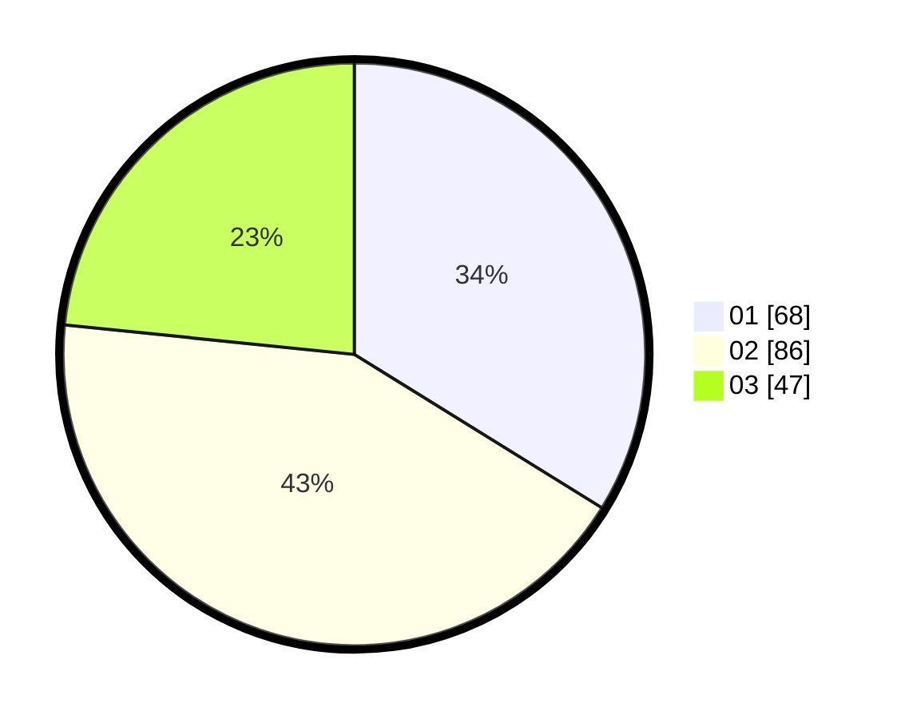

# Hasil

Hasil perolehan suara paslon dapat dilihat pada file paslon-01.txt, paslon-02.txt, dan paslon-03.txt.

Jika tidak ada, artinya data tersebut belum ada pada SIREKAP.

## Perolehan Suara

 * Paslon 01: **68**.
 * Paslon 02: **86**.
 * Paslon 03: **47**.

## Foto C Plano

https://sirekap-obj-formc.kpu.go.id/df32/pemilu/ppwp/31/71/03/10/03/3171031003013-20240214-202707--146e2e1f-41dc-47f4-854e-3ad4b35b42c8.jpg

https://sirekap-obj-formc.kpu.go.id/df32/pemilu/ppwp/31/71/03/10/03/3171031003013-20240214-213941--b42e6f28-f756-4a08-845e-5cd8c2573763.jpg

https://sirekap-obj-formc.kpu.go.id/df32/pemilu/ppwp/31/71/03/10/03/3171031003013-20240214-210454--c0480627-3adc-4ffd-aa3b-758365b1fbda.jpg

## DATA PEMILIH TETAP

Jumlah pemilih dalam DPT: **268**.
 * L: **130**.
 * P: **138**.

## DATA PENGGUNA HAK PILIH

Jumlah pengguna hak pilih dalam DPT: **198**.
 * L: **92**.
 * P: **106**.

Jumlah pengguna hak pilih dalam DPTb: **2**.
 * L: **1**.
 * P: **1**.

Jumlah pengguna hak pilih dalam DPK: **4**.
 * L: **1**.
 * P: **3**.

Jumlah pengguna hak pilih: **204**.
 * L: **94**.
 * P: **110**.

## JUMLAH SUARA SAH DAN TIDAK SAH

JUMLAH SELURUH SUARA SAH: **201**.

JUMLAH SUARA TIDAK SAH: **3**.

JUMLAH SELURUH SUARA SAH DAN SUARA TIDAK SAH: **204**.
