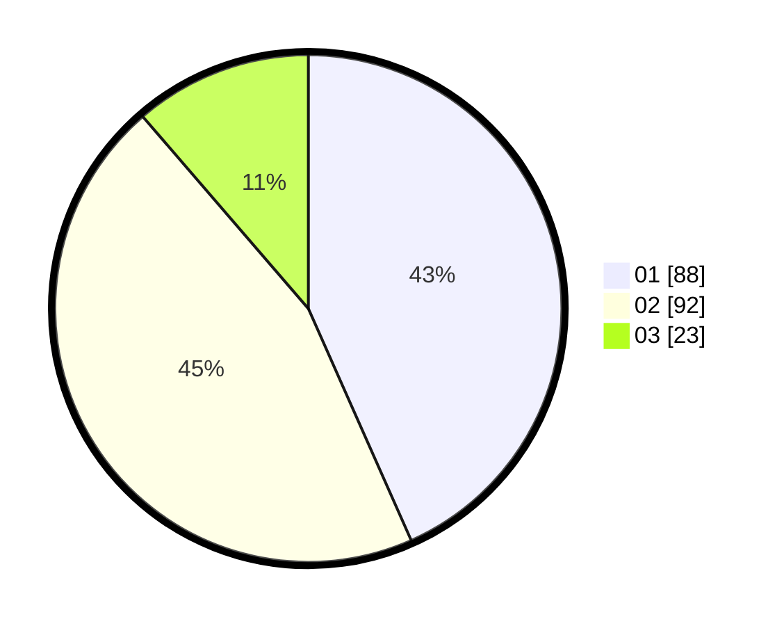

# Hasil

Hasil perolehan suara paslon dapat dilihat pada file paslon-01.txt, paslon-02.txt, dan paslon-03.txt.

Jika tidak ada, artinya data tersebut belum ada pada SIREKAP.

## Perolehan Suara

 * Paslon 01: **88**.
 * Paslon 02: **92**.
 * Paslon 03: **23**.

## Foto C Plano

https://sirekap-obj-formc.kpu.go.id/a7e8/pemilu/ppwp/31/71/03/10/03/3171031003014-20240214-192643--d8073504-9c9d-4c5f-a621-e0f86955b903.jpg

https://sirekap-obj-formc.kpu.go.id/a7e8/pemilu/ppwp/31/71/03/10/03/3171031003014-20240214-191830--1b8e1fca-3f40-4731-8861-017d1ee89225.jpg

https://sirekap-obj-formc.kpu.go.id/a7e8/pemilu/ppwp/31/71/03/10/03/3171031003014-20240214-191708--146640ee-53ce-43d8-93f8-41d0cb95e593.jpg

## DATA PEMILIH TETAP

Jumlah pemilih dalam DPT: **270**.
 * L: **134**.
 * P: **136**.

## DATA PENGGUNA HAK PILIH

Jumlah pengguna hak pilih dalam DPT: **202**.
 * L: **96**.
 * P: **106**.

Jumlah pengguna hak pilih dalam DPTb: **0**.
 * L: **0**.
 * P: **0**.

Jumlah pengguna hak pilih dalam DPK: **3**.
 * L: **1**.
 * P: **2**.

Jumlah pengguna hak pilih: **205**.
 * L: **97**.
 * P: **108**.

## JUMLAH SUARA SAH DAN TIDAK SAH

JUMLAH SELURUH SUARA SAH: **203**.

JUMLAH SUARA TIDAK SAH: **2**.

JUMLAH SELURUH SUARA SAH DAN SUARA TIDAK SAH: **205**.
