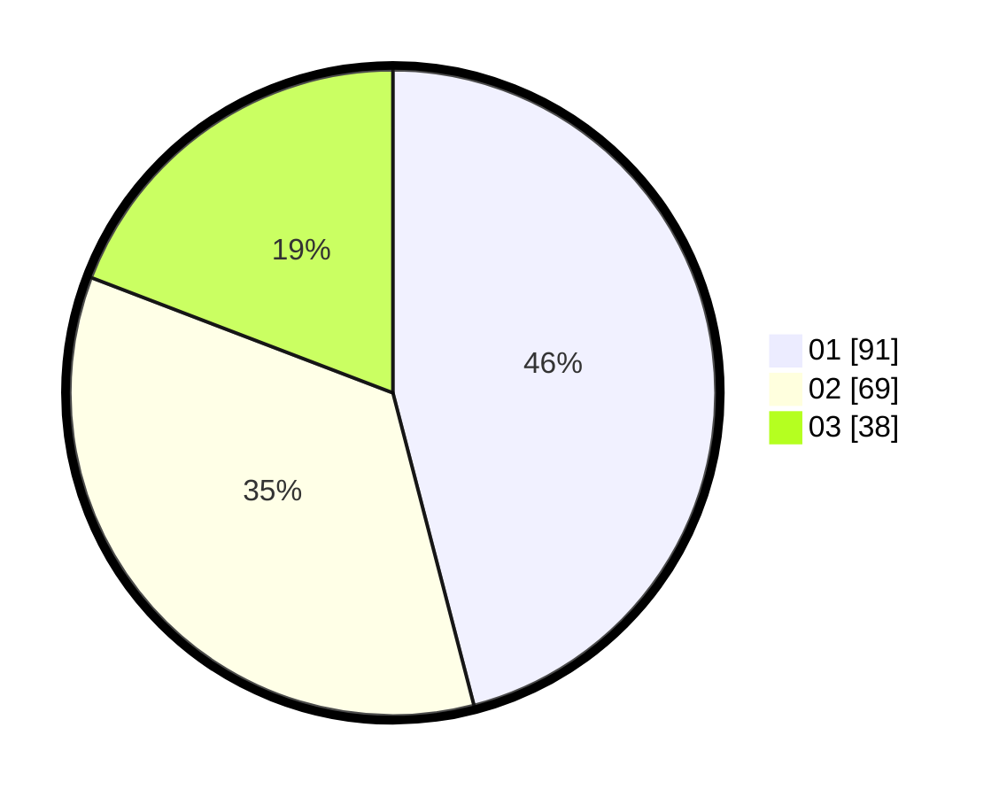

# Hasil

Hasil perolehan suara paslon dapat dilihat pada file paslon-01.txt, paslon-02.txt, dan paslon-03.txt.

Jika tidak ada, artinya data tersebut belum ada pada SIREKAP.

## Perolehan Suara

 * Paslon 01: **91**.
 * Paslon 02: **69**.
 * Paslon 03: **38**.

## Foto C Plano

https://sirekap-obj-formc.kpu.go.id/cf3b/pemilu/ppwp/31/71/03/10/03/3171031003016-20240214-155022--12e38e08-b496-4c89-b110-8dfa6924f052.jpg

https://sirekap-obj-formc.kpu.go.id/cf3b/pemilu/ppwp/31/71/03/10/03/3171031003016-20240214-155141--276392a6-44c3-4680-8a90-76957cf80c8e.jpg

https://sirekap-obj-formc.kpu.go.id/cf3b/pemilu/ppwp/31/71/03/10/03/3171031003016-20240214-155245--6d708b19-7af8-493d-a47c-a894fa1d664c.jpg

## DATA PEMILIH TETAP

Jumlah pemilih dalam DPT: **270**.
 * L: **138**.
 * P: **132**.

## DATA PENGGUNA HAK PILIH

Jumlah pengguna hak pilih dalam DPT: **201**.
 * L: **102**.
 * P: **99**.

Jumlah pengguna hak pilih dalam DPTb: **3**.
 * L: **1**.
 * P: **2**.

Jumlah pengguna hak pilih dalam DPK: **0**.
 * L: **0**.
 * P: **0**.

Jumlah pengguna hak pilih: **204**.
 * L: **103**.
 * P: **101**.

## JUMLAH SUARA SAH DAN TIDAK SAH

JUMLAH SELURUH SUARA SAH: **198**.

JUMLAH SUARA TIDAK SAH: **6**.

JUMLAH SELURUH SUARA SAH DAN SUARA TIDAK SAH: **204**.
