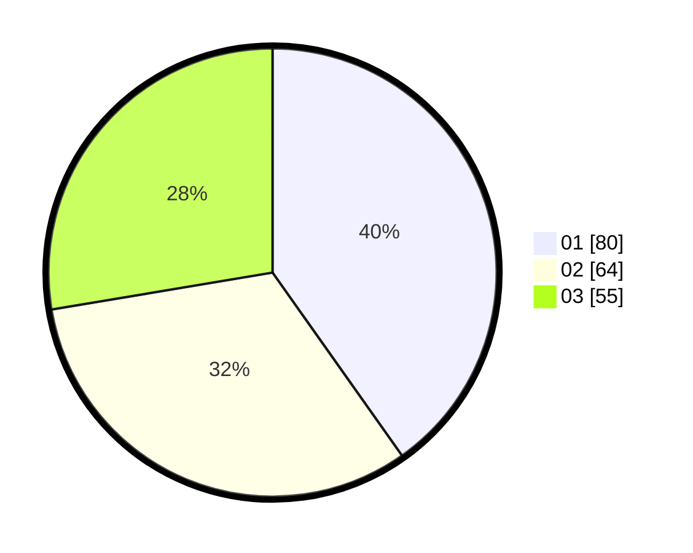

# Hasil

Hasil perolehan suara paslon dapat dilihat pada file paslon-01.txt, paslon-02.txt, dan paslon-03.txt.

Jika tidak ada, artinya data tersebut belum ada pada SIREKAP.

## Perolehan Suara

 * Paslon 01: **80**.
 * Paslon 02: **64**.
 * Paslon 03: **55**.

## Foto C Plano

https://sirekap-obj-formc.kpu.go.id/cb09/pemilu/ppwp/31/71/03/10/03/3171031003017-20240215-133730--bafac9e4-fe0a-46c5-8387-9a768861bddd.jpg

https://sirekap-obj-formc.kpu.go.id/cb09/pemilu/ppwp/31/71/03/10/03/3171031003017-20240214-204928--f111b8b9-bc46-4604-ba91-15b6296ed4a4.jpg

https://sirekap-obj-formc.kpu.go.id/cb09/pemilu/ppwp/31/71/03/10/03/3171031003017-20240214-204110--6fca4187-3428-419f-8614-d5f6e2130d92.jpg
