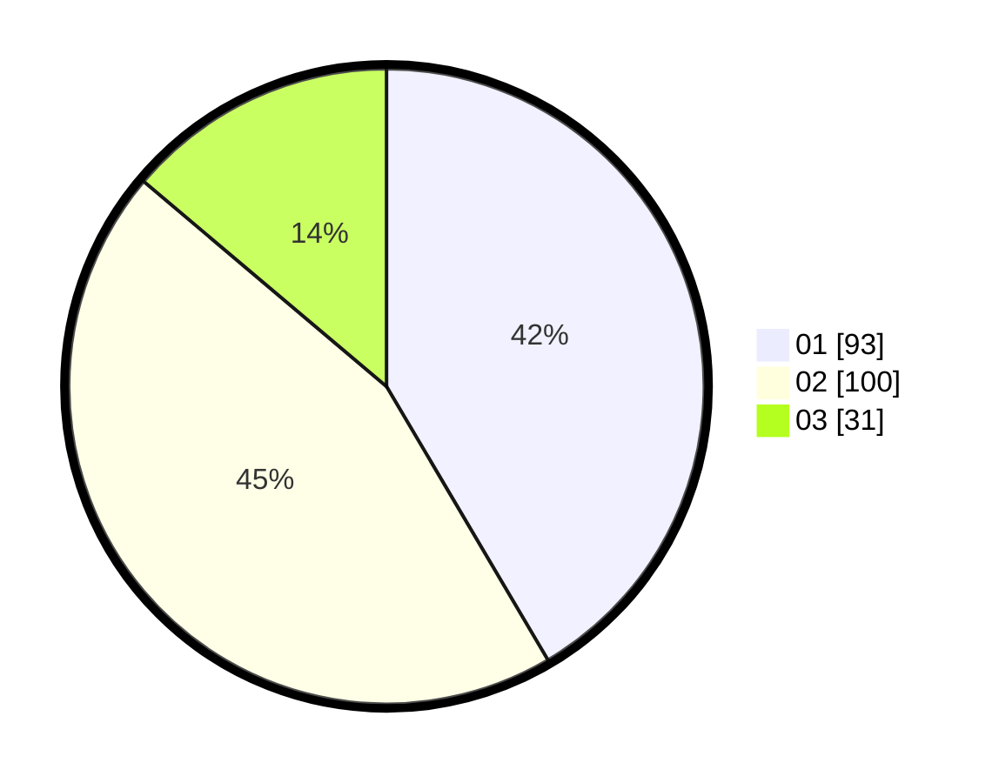

# Hasil

Hasil perolehan suara paslon dapat dilihat pada file paslon-01.txt, paslon-02.txt, dan paslon-03.txt.

Jika tidak ada, artinya data tersebut belum ada pada SIREKAP.

## Perolehan Suara

 * Paslon 01: **93**.
 * Paslon 02: **100**.
 * Paslon 03: **31**.

## Foto C Plano

https://sirekap-obj-formc.kpu.go.id/3909/pemilu/ppwp/31/71/03/10/03/3171031003020-20240216-133723--19ad274c-92af-4104-b6e0-74c37e3154c5.jpg

https://sirekap-obj-formc.kpu.go.id/3909/pemilu/ppwp/31/71/03/10/03/3171031003020-20240216-133724--5b9f371b-6278-4ccf-9f25-8309baed4ba1.jpg

https://sirekap-obj-formc.kpu.go.id/3909/pemilu/ppwp/31/71/03/10/03/3171031003020-20240216-133724--568a1bb0-e8a1-41a6-aa2b-a6cd9019460b.jpg

## DATA PEMILIH TETAP

Jumlah pemilih dalam DPT: **288**.
 * L: **144**.
 * P: **144**.

## DATA PENGGUNA HAK PILIH

Jumlah pengguna hak pilih dalam DPT: **229**.
 * L: **112**.
 * P: **117**.

Jumlah pengguna hak pilih dalam DPTb: **2**.
 * L: **1**.
 * P: **1**.

Jumlah pengguna hak pilih dalam DPK: **2**.
 * L: **2**.
 * P: **0**.

Jumlah pengguna hak pilih: **233**.
 * L: **115**.
 * P: **118**.

## JUMLAH SUARA SAH DAN TIDAK SAH

JUMLAH SELURUH SUARA SAH: **224**.

JUMLAH SUARA TIDAK SAH: **9**.

JUMLAH SELURUH SUARA SAH DAN SUARA TIDAK SAH: **233**.
