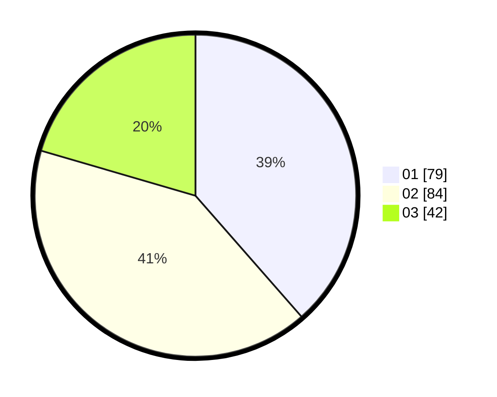

# Hasil

Hasil perolehan suara paslon dapat dilihat pada file paslon-01.txt, paslon-02.txt, dan paslon-03.txt.

Jika tidak ada, artinya data tersebut belum ada pada SIREKAP.

## Perolehan Suara

 * Paslon 01: **79**.
 * Paslon 02: **84**.
 * Paslon 03: **42**.

## Foto C Plano

https://sirekap-obj-formc.kpu.go.id/4d17/pemilu/ppwp/31/71/03/10/03/3171031003021-20240214-232711--47476934-acfc-4f2b-95b2-25b96f91c7de.jpg

https://sirekap-obj-formc.kpu.go.id/4d17/pemilu/ppwp/31/71/03/10/03/3171031003021-20240214-204534--f5ea3854-2537-43db-a1ec-b6a8cdba330c.jpg

https://sirekap-obj-formc.kpu.go.id/4d17/pemilu/ppwp/31/71/03/10/03/3171031003021-20240214-233216--defb1d23-c6b6-43b9-8d53-21fb51ba8e75.jpg
