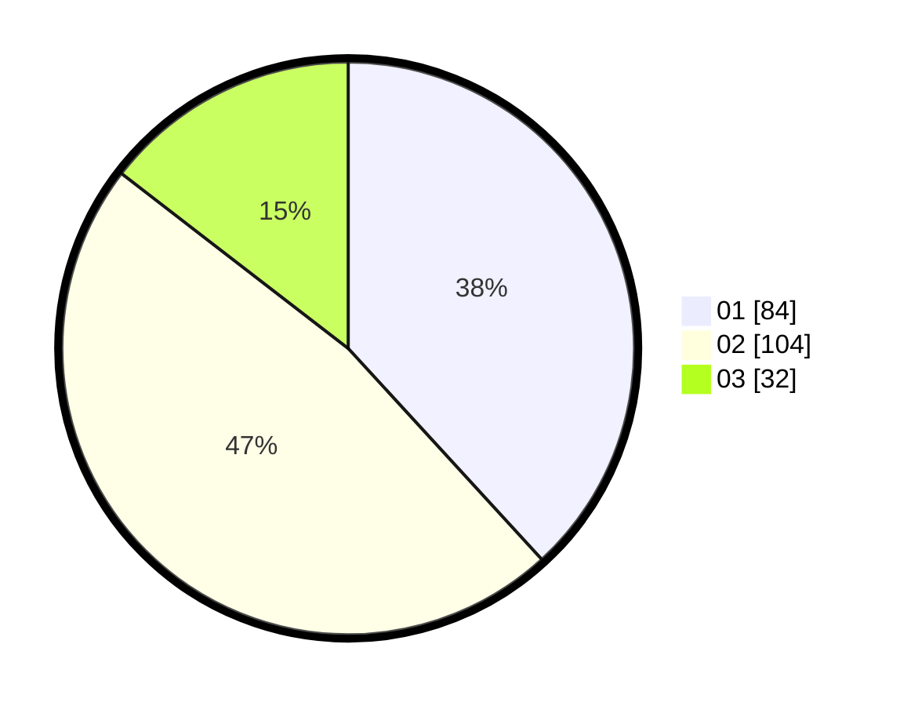

# Hasil

Hasil perolehan suara paslon dapat dilihat pada file paslon-01.txt, paslon-02.txt, dan paslon-03.txt.

Jika tidak ada, artinya data tersebut belum ada pada SIREKAP.

## Perolehan Suara

 * Paslon 01: **84**.
 * Paslon 02: **104**.
 * Paslon 03: **32**.

## Foto C Plano

https://sirekap-obj-formc.kpu.go.id/67b7/pemilu/ppwp/31/71/03/10/03/3171031003022-20240216-030328--bba8cc77-b6f4-4bc5-9551-0b3eff9fe059.jpg

https://sirekap-obj-formc.kpu.go.id/67b7/pemilu/ppwp/31/71/03/10/03/3171031003022-20240216-030338--58bc44bc-359c-471b-a0d1-0c191cf2c083.jpg

https://sirekap-obj-formc.kpu.go.id/67b7/pemilu/ppwp/31/71/03/10/03/3171031003022-20240216-030334--95842afb-c846-4ec1-9922-2dcc05f204bb.jpg

## DATA PEMILIH TETAP

Jumlah pemilih dalam DPT: **213**.
 * L: **104**.
 * P: **109**.

## DATA PENGGUNA HAK PILIH

Jumlah pengguna hak pilih dalam DPT: **213**.
 * L: **104**.
 * P: **109**.

Jumlah pengguna hak pilih dalam DPTb: **3**.
 * L: **2**.
 * P: **1**.

Jumlah pengguna hak pilih dalam DPK: **6**.
 * L: **2**.
 * P: **4**.

Jumlah pengguna hak pilih: **222**.
 * L: **108**.
 * P: **114**.

## JUMLAH SUARA SAH DAN TIDAK SAH

JUMLAH SELURUH SUARA SAH: **220**.

JUMLAH SUARA TIDAK SAH: **2**.

JUMLAH SELURUH SUARA SAH DAN SUARA TIDAK SAH: **222**.
