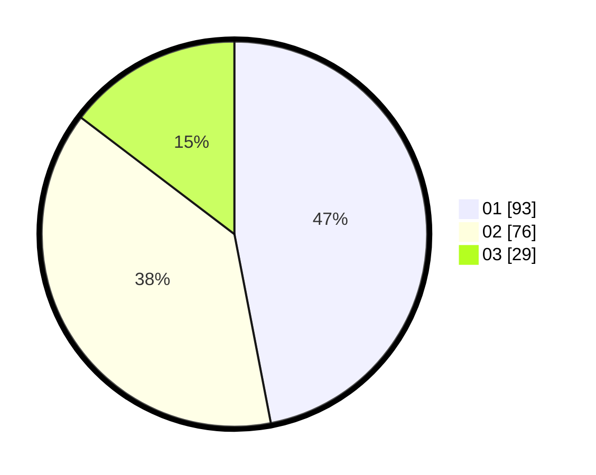

# Hasil

Hasil perolehan suara paslon dapat dilihat pada file paslon-01.txt, paslon-02.txt, dan paslon-03.txt.

Jika tidak ada, artinya data tersebut belum ada pada SIREKAP.

## Perolehan Suara

 * Paslon 01: **93**.
 * Paslon 02: **76**.
 * Paslon 03: **29**.

## Foto C Plano

https://sirekap-obj-formc.kpu.go.id/4f39/pemilu/ppwp/31/71/03/10/03/3171031003023-20240216-180418--3a590fc2-ba47-4543-ad30-c6621e61584d.jpg

https://sirekap-obj-formc.kpu.go.id/4f39/pemilu/ppwp/31/71/03/10/03/3171031003023-20240216-180420--3dc37582-15b6-463f-b19e-a3efeb515fa6.jpg

https://sirekap-obj-formc.kpu.go.id/4f39/pemilu/ppwp/31/71/03/10/03/3171031003023-20240216-180419--69d16c75-62e3-4fcf-8013-66dc48920184.jpg

## DATA PEMILIH TETAP

Jumlah pemilih dalam DPT: **264**.
 * L: **128**.
 * P: **136**.

## DATA PENGGUNA HAK PILIH

Jumlah pengguna hak pilih dalam DPT: **197**.
 * L: **109**.
 * P: **88**.

Jumlah pengguna hak pilih dalam DPTb: **2**.
 * L: **1**.
 * P: **1**.

Jumlah pengguna hak pilih dalam DPK: **0**.
 * L: **0**.
 * P: **0**.

Jumlah pengguna hak pilih: **199**.
 * L: **110**.
 * P: **89**.

## JUMLAH SUARA SAH DAN TIDAK SAH

JUMLAH SELURUH SUARA SAH: **194**.

JUMLAH SUARA TIDAK SAH: **5**.

JUMLAH SELURUH SUARA SAH DAN SUARA TIDAK SAH: **199**.
