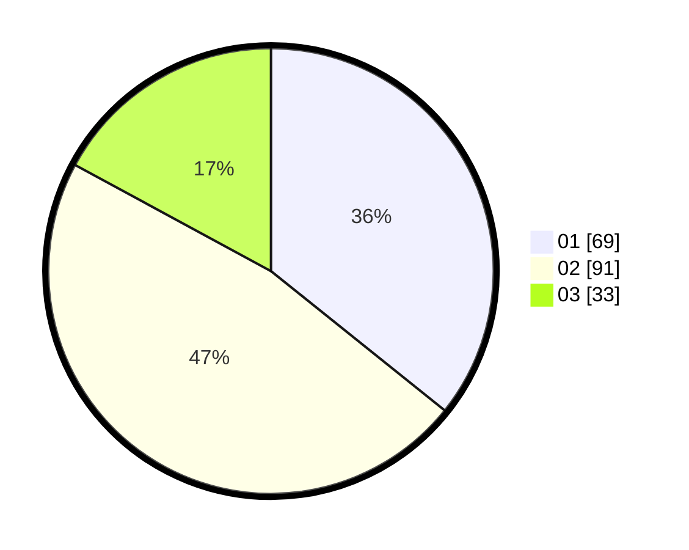

# Hasil

Hasil perolehan suara paslon dapat dilihat pada file paslon-01.txt, paslon-02.txt, dan paslon-03.txt.

Jika tidak ada, artinya data tersebut belum ada pada SIREKAP.

## Perolehan Suara

 * Paslon 01: **69**.
 * Paslon 02: **91**.
 * Paslon 03: **33**.

## Foto C Plano

https://sirekap-obj-formc.kpu.go.id/b02c/pemilu/ppwp/31/71/03/10/03/3171031003025-20240216-185022--71f42800-2eb5-45b6-9ca1-f5d75202d65c.jpg

https://sirekap-obj-formc.kpu.go.id/b02c/pemilu/ppwp/31/71/03/10/03/3171031003025-20240216-185023--ef6c59a8-0064-4fdd-8eb0-0ebd7369b3aa.jpg

https://sirekap-obj-formc.kpu.go.id/b02c/pemilu/ppwp/31/71/03/10/03/3171031003025-20240216-185022--bcb37b35-c324-40e8-9d83-1715bac95177.jpg

## DATA PEMILIH TETAP

Jumlah pemilih dalam DPT: **246**.
 * L: **133**.
 * P: **113**.

## DATA PENGGUNA HAK PILIH

Jumlah pengguna hak pilih dalam DPT: **186**.
 * L: **97**.
 * P: **89**.

Jumlah pengguna hak pilih dalam DPTb: **2**.
 * L: **1**.
 * P: **1**.

Jumlah pengguna hak pilih dalam DPK: **7**.
 * L: **3**.
 * P: **4**.

Jumlah pengguna hak pilih: **195**.
 * L: **101**.
 * P: **94**.

## JUMLAH SUARA SAH DAN TIDAK SAH

JUMLAH SELURUH SUARA SAH: **193**.

JUMLAH SUARA TIDAK SAH: **2**.

JUMLAH SELURUH SUARA SAH DAN SUARA TIDAK SAH: **195**.
