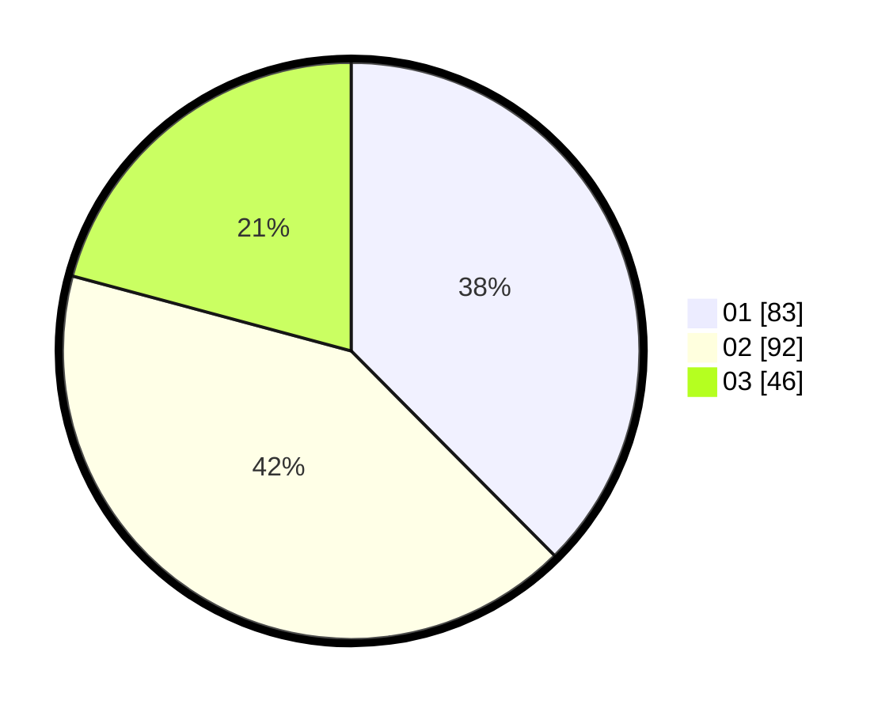

# Hasil

Hasil perolehan suara paslon dapat dilihat pada file paslon-01.txt, paslon-02.txt, dan paslon-03.txt.

Jika tidak ada, artinya data tersebut belum ada pada SIREKAP.

## Perolehan Suara

 * Paslon 01: **83**.
 * Paslon 02: **92**.
 * Paslon 03: **46**.

## Foto C Plano

https://sirekap-obj-formc.kpu.go.id/7a76/pemilu/ppwp/31/71/03/10/03/3171031003028-20240214-224414--01c9f906-553a-4a89-a2ab-d26535539ee2.jpg

https://sirekap-obj-formc.kpu.go.id/7a76/pemilu/ppwp/31/71/03/10/03/3171031003028-20240214-224931--5ecea157-3a85-4514-9a8b-7626b3651df1.jpg

https://sirekap-obj-formc.kpu.go.id/7a76/pemilu/ppwp/31/71/03/10/03/3171031003028-20240214-225152--5996d4fa-1fdf-4ad8-8a0c-9432c29b5161.jpg
