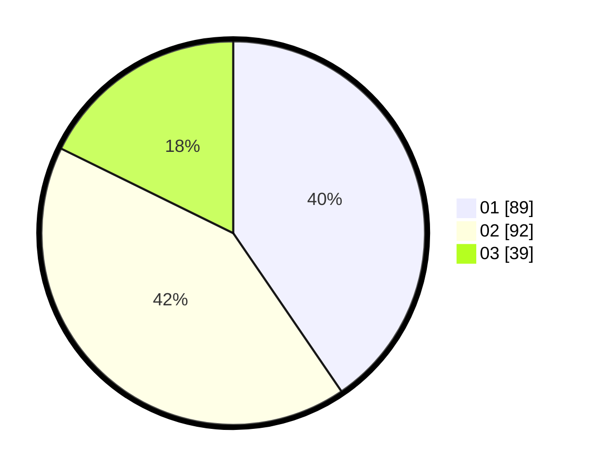

# Hasil

Hasil perolehan suara paslon dapat dilihat pada file paslon-01.txt, paslon-02.txt, dan paslon-03.txt.

Jika tidak ada, artinya data tersebut belum ada pada SIREKAP.

## Perolehan Suara

 * Paslon 01: **89**.
 * Paslon 02: **92**.
 * Paslon 03: **39**.

## Foto C Plano

https://sirekap-obj-formc.kpu.go.id/3a92/pemilu/ppwp/31/71/03/10/03/3171031003037-20240216-190438--597cbe61-87aa-4f00-ace8-fb7c376b70c7.jpg

https://sirekap-obj-formc.kpu.go.id/3a92/pemilu/ppwp/31/71/03/10/03/3171031003037-20240216-190440--296bbc57-32a9-4b79-9e8d-1396070b6d9d.jpg

https://sirekap-obj-formc.kpu.go.id/3a92/pemilu/ppwp/31/71/03/10/03/3171031003037-20240216-190439--9b0045b6-514d-4c25-88d8-3fe90f031303.jpg

## DATA PEMILIH TETAP

Jumlah pemilih dalam DPT: **286**.
 * L: **146**.
 * P: **140**.

## DATA PENGGUNA HAK PILIH

Jumlah pengguna hak pilih dalam DPT: **218**.
 * L: **108**.
 * P: **110**.

Jumlah pengguna hak pilih dalam DPTb: **0**.
 * L: **0**.
 * P: **0**.

Jumlah pengguna hak pilih dalam DPK: **3**.
 * L: **2**.
 * P: **1**.

Jumlah pengguna hak pilih: **221**.
 * L: **110**.
 * P: **111**.

## JUMLAH SUARA SAH DAN TIDAK SAH

JUMLAH SELURUH SUARA SAH: **220**.

JUMLAH SUARA TIDAK SAH: **1**.

JUMLAH SELURUH SUARA SAH DAN SUARA TIDAK SAH: **221**.
