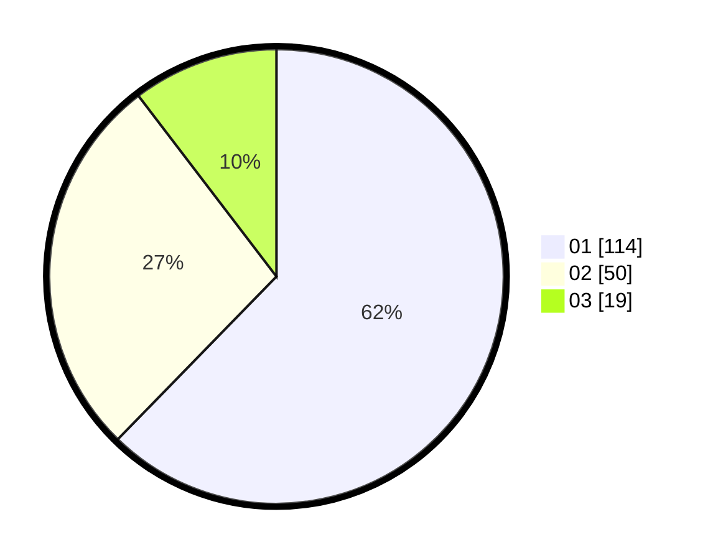

# Hasil

Hasil perolehan suara paslon dapat dilihat pada file paslon-01.txt, paslon-02.txt, dan paslon-03.txt.

Jika tidak ada, artinya data tersebut belum ada pada SIREKAP.

## Perolehan Suara

 * Paslon 01: **114**.
 * Paslon 02: **50**.
 * Paslon 03: **19**.

## Foto C Plano

https://sirekap-obj-formc.kpu.go.id/c06e/pemilu/ppwp/31/71/03/10/03/3171031003038-20240216-032329--52b8a08c-882a-4b74-b44c-24a3f4d120b9.jpg

https://sirekap-obj-formc.kpu.go.id/c06e/pemilu/ppwp/31/71/03/10/03/3171031003038-20240216-032331--3968415f-5615-46dc-9777-68edb1198091.jpg

https://sirekap-obj-formc.kpu.go.id/c06e/pemilu/ppwp/31/71/03/10/03/3171031003038-20240214-205457--26a6a829-5785-4839-9fba-bf5f41f6bc25.jpg

## DATA PEMILIH TETAP

Jumlah pemilih dalam DPT: **247**.
 * L: **129**.
 * P: **118**.

## DATA PENGGUNA HAK PILIH

Jumlah pengguna hak pilih dalam DPT: **187**.
 * L: **100**.
 * P: **87**.

Jumlah pengguna hak pilih dalam DPTb: **1**.
 * L: **0**.
 * P: **1**.

Jumlah pengguna hak pilih dalam DPK: **2**.
 * L: **1**.
 * P: **1**.

Jumlah pengguna hak pilih: **190**.
 * L: **101**.
 * P: **89**.

## JUMLAH SUARA SAH DAN TIDAK SAH

JUMLAH SELURUH SUARA SAH: **183**.

JUMLAH SUARA TIDAK SAH: **7**.

JUMLAH SELURUH SUARA SAH DAN SUARA TIDAK SAH: **190**.
