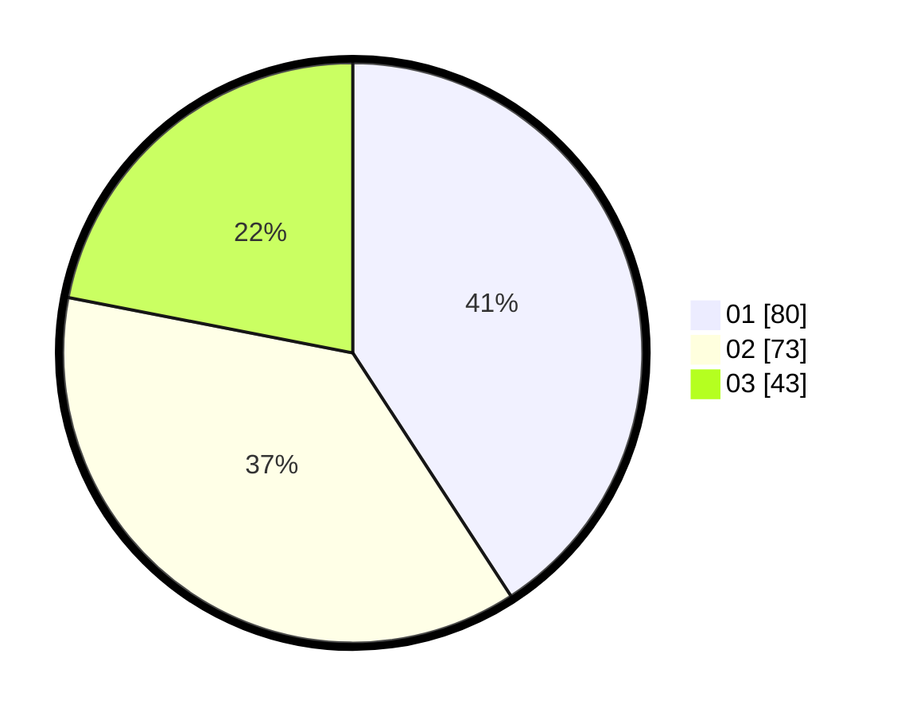

# Hasil

Hasil perolehan suara paslon dapat dilihat pada file paslon-01.txt, paslon-02.txt, dan paslon-03.txt.

Jika tidak ada, artinya data tersebut belum ada pada SIREKAP.

## Perolehan Suara

 * Paslon 01: **80**.
 * Paslon 02: **73**.
 * Paslon 03: **43**.

## Foto C Plano

https://sirekap-obj-formc.kpu.go.id/41eb/pemilu/ppwp/31/71/03/10/03/3171031003040-20240214-221649--53cb78c4-ff55-4b35-ad57-e4c5ab3044af.jpg

https://sirekap-obj-formc.kpu.go.id/41eb/pemilu/ppwp/31/71/03/10/03/3171031003040-20240214-221830--ab7344b5-1a0f-4aca-a7c7-0216b4bdf035.jpg

https://sirekap-obj-formc.kpu.go.id/41eb/pemilu/ppwp/31/71/03/10/03/3171031003040-20240214-222049--11a8e677-a9e8-4f51-9406-cb47dd09d612.jpg
