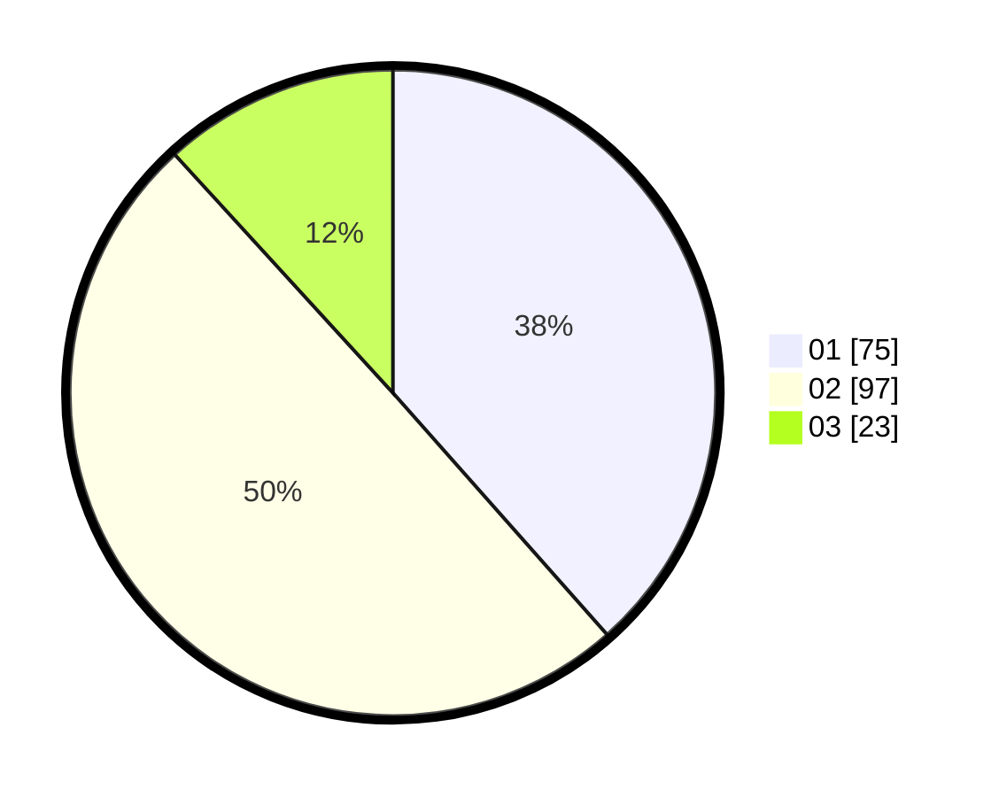

# Hasil

Hasil perolehan suara paslon dapat dilihat pada file paslon-01.txt, paslon-02.txt, dan paslon-03.txt.

Jika tidak ada, artinya data tersebut belum ada pada SIREKAP.

## Perolehan Suara

 * Paslon 01: **75**.
 * Paslon 02: **97**.
 * Paslon 03: **23**.

## Foto C Plano

https://sirekap-obj-formc.kpu.go.id/5d2a/pemilu/ppwp/31/71/03/10/03/3171031003042-20240215-002344--be190ba1-df31-4e9c-84a6-7d7697f83d85.jpg

https://sirekap-obj-formc.kpu.go.id/5d2a/pemilu/ppwp/31/71/03/10/03/3171031003042-20240215-002406--33d1d591-69b6-4ba9-b535-2abb3d53e148.jpg

https://sirekap-obj-formc.kpu.go.id/5d2a/pemilu/ppwp/31/71/03/10/03/3171031003042-20240215-002446--02dab596-6011-4c1d-bb4e-bd1153b0bcc9.jpg
