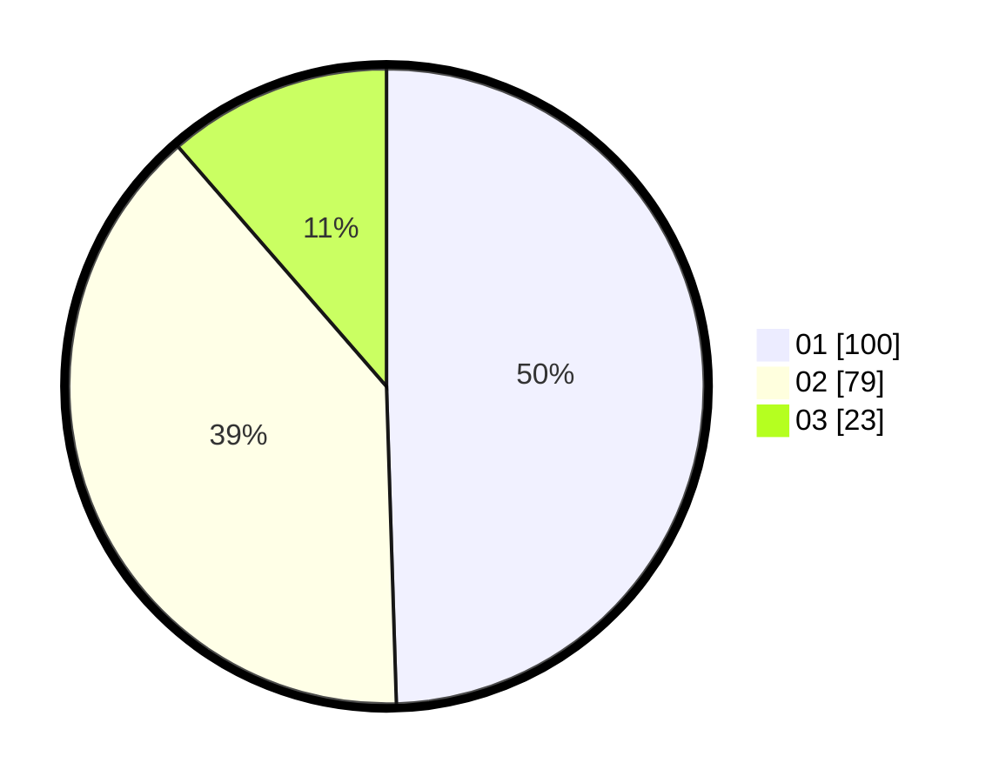

# Hasil

Hasil perolehan suara paslon dapat dilihat pada file paslon-01.txt, paslon-02.txt, dan paslon-03.txt.

Jika tidak ada, artinya data tersebut belum ada pada SIREKAP.

## Perolehan Suara

 * Paslon 01: **100**.
 * Paslon 02: **79**.
 * Paslon 03: **23**.

## Foto C Plano

https://sirekap-obj-formc.kpu.go.id/c7aa/pemilu/ppwp/31/71/03/10/03/3171031003044-20240216-144322--1aa0a673-aad2-4049-a092-19dfd14c72aa.jpg

https://sirekap-obj-formc.kpu.go.id/c7aa/pemilu/ppwp/31/71/03/10/03/3171031003044-20240216-144323--297e2c0d-2d02-4ccc-b170-4b914caf181e.jpg

https://sirekap-obj-formc.kpu.go.id/c7aa/pemilu/ppwp/31/71/03/10/03/3171031003044-20240216-144323--b655e845-5702-426a-bf84-43fd7f3669cc.jpg

## DATA PEMILIH TETAP

Jumlah pemilih dalam DPT: **204**.
 * L: **103**.
 * P: **101**.

## DATA PENGGUNA HAK PILIH

Jumlah pengguna hak pilih dalam DPT: **201**.
 * L: **101**.
 * P: **100**.

Jumlah pengguna hak pilih dalam DPTb: **2**.
 * L: **1**.
 * P: **1**.

Jumlah pengguna hak pilih dalam DPK: **1**.
 * L: **1**.
 * P: **0**.

Jumlah pengguna hak pilih: **204**.
 * L: **103**.
 * P: **101**.

## JUMLAH SUARA SAH DAN TIDAK SAH

JUMLAH SELURUH SUARA SAH: **202**.

JUMLAH SUARA TIDAK SAH: **2**.

JUMLAH SELURUH SUARA SAH DAN SUARA TIDAK SAH: **204**.
