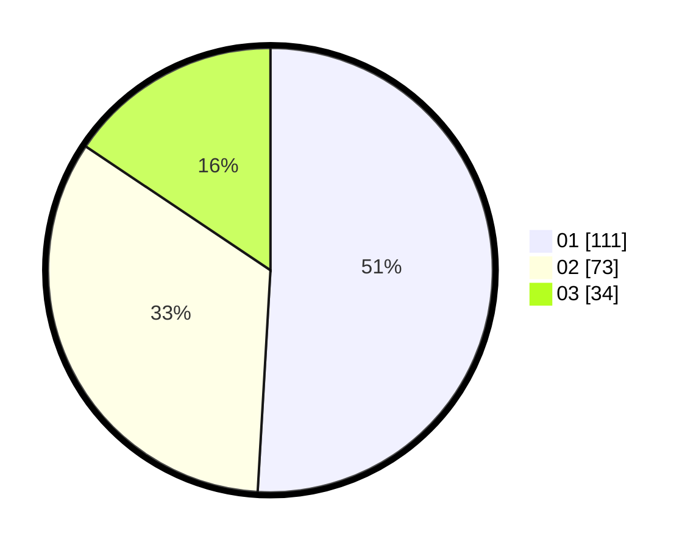

# Hasil

Hasil perolehan suara paslon dapat dilihat pada file paslon-01.txt, paslon-02.txt, dan paslon-03.txt.

Jika tidak ada, artinya data tersebut belum ada pada SIREKAP.

## Perolehan Suara

 * Paslon 01: **111**.
 * Paslon 02: **73**.
 * Paslon 03: **34**.

## Foto C Plano

https://sirekap-obj-formc.kpu.go.id/eb32/pemilu/ppwp/31/71/03/10/03/3171031003046-20240214-204842--a54e2a6a-72b1-4ea1-a3b7-716785a9c7c3.jpg

https://sirekap-obj-formc.kpu.go.id/eb32/pemilu/ppwp/31/71/03/10/03/3171031003046-20240215-020127--9336a661-2df0-47f0-9edb-8b0251964010.jpg

https://sirekap-obj-formc.kpu.go.id/eb32/pemilu/ppwp/31/71/03/10/03/3171031003046-20240215-000450--0661666a-f29f-4f73-8127-3dd5cd642a3a.jpg

## DATA PEMILIH TETAP

Jumlah pemilih dalam DPT: **284**.
 * L: **138**.
 * P: **146**.

## DATA PENGGUNA HAK PILIH

Jumlah pengguna hak pilih dalam DPT: **219**.
 * L: **99**.
 * P: **120**.

Jumlah pengguna hak pilih dalam DPTb: **1**.
 * L: **1**.
 * P: **0**.

Jumlah pengguna hak pilih dalam DPK: **1**.
 * L: **1**.
 * P: **0**.

Jumlah pengguna hak pilih: **221**.
 * L: **101**.
 * P: **120**.

## JUMLAH SUARA SAH DAN TIDAK SAH

JUMLAH SELURUH SUARA SAH: **218**.

JUMLAH SUARA TIDAK SAH: **3**.

JUMLAH SELURUH SUARA SAH DAN SUARA TIDAK SAH: **221**.
