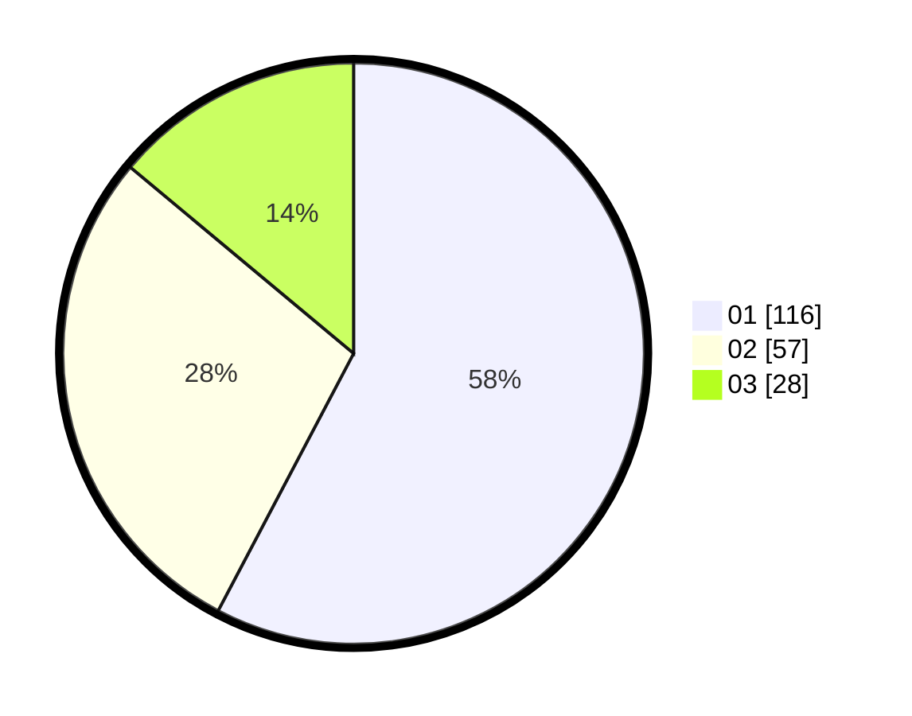

# Hasil

Hasil perolehan suara paslon dapat dilihat pada file paslon-01.txt, paslon-02.txt, dan paslon-03.txt.

Jika tidak ada, artinya data tersebut belum ada pada SIREKAP.

## Perolehan Suara

 * Paslon 01: **116**.
 * Paslon 02: **57**.
 * Paslon 03: **28**.

## Foto C Plano

https://sirekap-obj-formc.kpu.go.id/3d7f/pemilu/ppwp/31/71/03/10/03/3171031003048-20240214-162234--b8bc0a11-cadd-46fc-aeab-67ce9770765e.jpg

https://sirekap-obj-formc.kpu.go.id/3d7f/pemilu/ppwp/31/71/03/10/03/3171031003048-20240214-155603--2690640d-d99c-4a2a-b53a-8ea754a64fef.jpg

https://sirekap-obj-formc.kpu.go.id/3d7f/pemilu/ppwp/31/71/03/10/03/3171031003048-20240214-193106--976b86d5-6ca0-486b-a05d-6c2fb8d60afa.jpg
