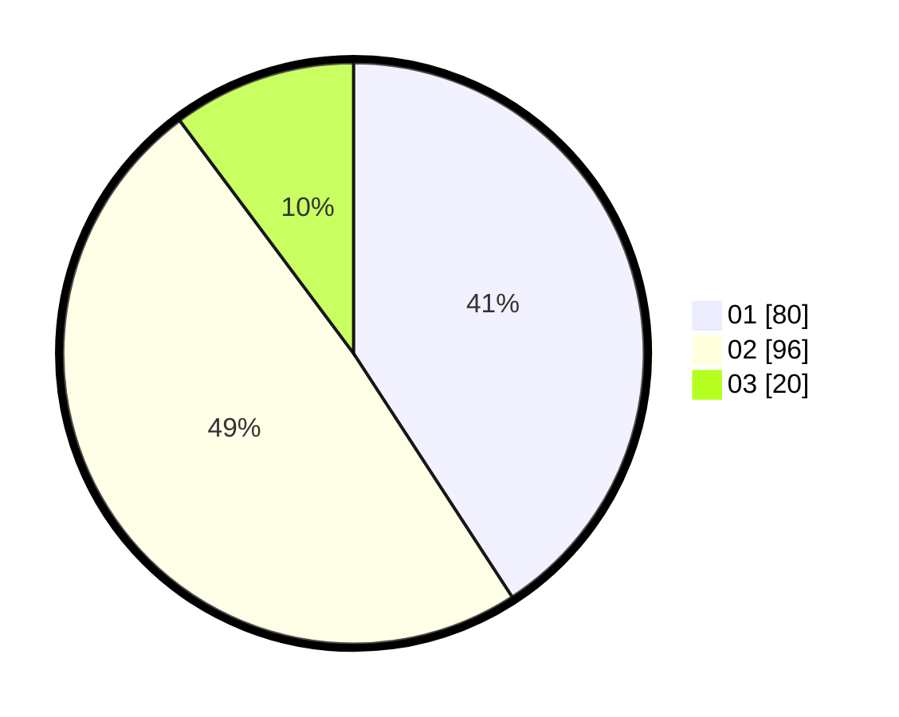

# Hasil

Hasil perolehan suara paslon dapat dilihat pada file paslon-01.txt, paslon-02.txt, dan paslon-03.txt.

Jika tidak ada, artinya data tersebut belum ada pada SIREKAP.

## Perolehan Suara

 * Paslon 01: **80**.
 * Paslon 02: **96**.
 * Paslon 03: **20**.

## Foto C Plano

https://sirekap-obj-formc.kpu.go.id/944f/pemilu/ppwp/31/71/03/10/03/3171031003053-20240217-053939--96ca851b-3114-4f91-8df2-1250f134a062.jpg

https://sirekap-obj-formc.kpu.go.id/944f/pemilu/ppwp/31/71/03/10/03/3171031003053-20240217-053940--53691f68-afc8-4222-adfb-2dc2186f6cbe.jpg

https://sirekap-obj-formc.kpu.go.id/944f/pemilu/ppwp/31/71/03/10/03/3171031003053-20240217-053940--238e24fa-6da4-4663-9806-c0589bf6c4b4.jpg

## DATA PEMILIH TETAP

Jumlah pemilih dalam DPT: **268**.
 * L: **132**.
 * P: **136**.

## DATA PENGGUNA HAK PILIH

Jumlah pengguna hak pilih dalam DPT: **197**.
 * L: **94**.
 * P: **103**.

Jumlah pengguna hak pilih dalam DPTb: **0**.
 * L: **0**.
 * P: **0**.

Jumlah pengguna hak pilih dalam DPK: **2**.
 * L: **1**.
 * P: **1**.

Jumlah pengguna hak pilih: **199**.
 * L: **95**.
 * P: **104**.

## JUMLAH SUARA SAH DAN TIDAK SAH

JUMLAH SELURUH SUARA SAH: **196**.

JUMLAH SUARA TIDAK SAH: **3**.

JUMLAH SELURUH SUARA SAH DAN SUARA TIDAK SAH: **199**.
