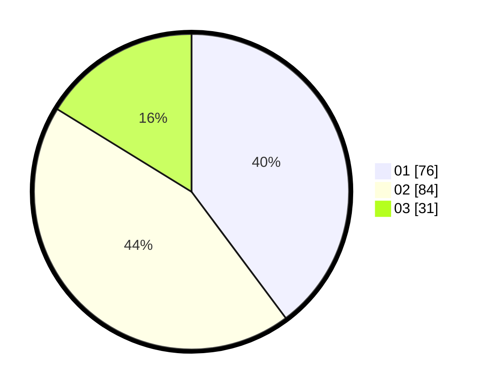

# Hasil

Hasil perolehan suara paslon dapat dilihat pada file paslon-01.txt, paslon-02.txt, dan paslon-03.txt.

Jika tidak ada, artinya data tersebut belum ada pada SIREKAP.

## Perolehan Suara

 * Paslon 01: **76**.
 * Paslon 02: **84**.
 * Paslon 03: **31**.

## Foto C Plano

https://sirekap-obj-formc.kpu.go.id/8d5c/pemilu/ppwp/31/71/03/10/03/3171031003057-20240214-223143--d0a7ec3c-1f31-4d5d-bb76-397daa1f5204.jpg

https://sirekap-obj-formc.kpu.go.id/8d5c/pemilu/ppwp/31/71/03/10/03/3171031003057-20240214-224021--78f016e4-fa9a-4047-b6d8-06e0923135bf.jpg

https://sirekap-obj-formc.kpu.go.id/8d5c/pemilu/ppwp/31/71/03/10/03/3171031003057-20240214-224101--892f1c01-e166-485e-869a-868de2fca28d.jpg
