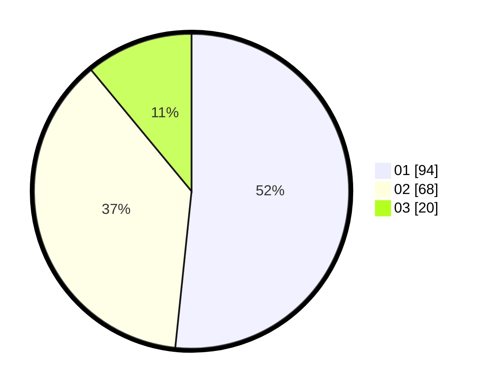

# Hasil

Hasil perolehan suara paslon dapat dilihat pada file paslon-01.txt, paslon-02.txt, dan paslon-03.txt.

Jika tidak ada, artinya data tersebut belum ada pada SIREKAP.

## Perolehan Suara

 * Paslon 01: **94**.
 * Paslon 02: **68**.
 * Paslon 03: **20**.

## Foto C Plano

https://sirekap-obj-formc.kpu.go.id/381a/pemilu/ppwp/31/71/03/10/03/3171031003058-20240215-003356--c22b14de-c9ae-4216-bf78-af972c2534bc.jpg

https://sirekap-obj-formc.kpu.go.id/381a/pemilu/ppwp/31/71/03/10/03/3171031003058-20240215-004005--973e1f67-3461-477a-b2f6-149d22e89dce.jpg

https://sirekap-obj-formc.kpu.go.id/381a/pemilu/ppwp/31/71/03/10/03/3171031003058-20240215-004141--bd91bac9-a7af-4385-b658-4c314101b2bf.jpg
