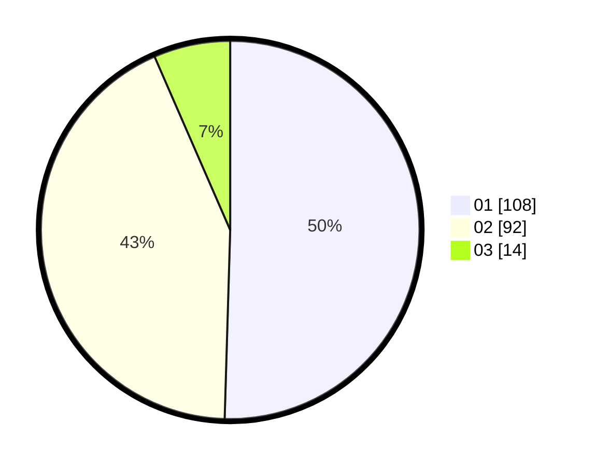

# Hasil

Hasil perolehan suara paslon dapat dilihat pada file paslon-01.txt, paslon-02.txt, dan paslon-03.txt.

Jika tidak ada, artinya data tersebut belum ada pada SIREKAP.

## Perolehan Suara

 * Paslon 01: **108**.
 * Paslon 02: **92**.
 * Paslon 03: **14**.

## Foto C Plano

https://sirekap-obj-formc.kpu.go.id/39c6/pemilu/ppwp/31/71/03/10/03/3171031003069-20240214-195329--055d41cd-579d-4eba-9279-15bdd9d3cb45.jpg

https://sirekap-obj-formc.kpu.go.id/39c6/pemilu/ppwp/31/71/03/10/03/3171031003069-20240214-195523--468d911e-3258-438c-8f73-412a14cc4332.jpg

https://sirekap-obj-formc.kpu.go.id/39c6/pemilu/ppwp/31/71/03/10/03/3171031003069-20240214-195703--3d683401-754b-49f8-92f6-70cb8a72f916.jpg
