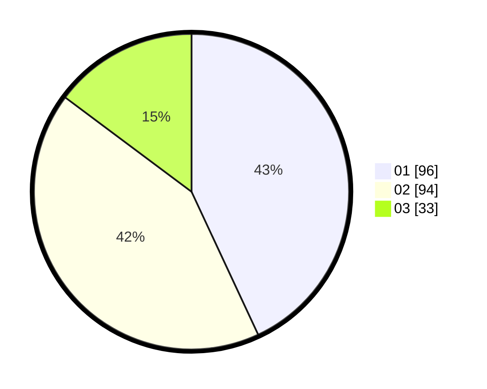

# Hasil

Hasil perolehan suara paslon dapat dilihat pada file paslon-01.txt, paslon-02.txt, dan paslon-03.txt.

Jika tidak ada, artinya data tersebut belum ada pada SIREKAP.

## Perolehan Suara

 * Paslon 01: **96**.
 * Paslon 02: **94**.
 * Paslon 03: **33**.

## Foto C Plano

https://sirekap-obj-formc.kpu.go.id/ed66/pemilu/ppwp/31/71/03/10/03/3171031003072-20240215-010010--54b8e1ad-4302-4257-b307-dfe9623fb456.jpg

https://sirekap-obj-formc.kpu.go.id/ed66/pemilu/ppwp/31/71/03/10/03/3171031003072-20240215-010156--5fe11c62-2663-4e47-bc73-a5a9d6870bcf.jpg

https://sirekap-obj-formc.kpu.go.id/ed66/pemilu/ppwp/31/71/03/10/03/3171031003072-20240215-010336--2c27ba00-24de-42fb-adb1-d9bda3f2653b.jpg
