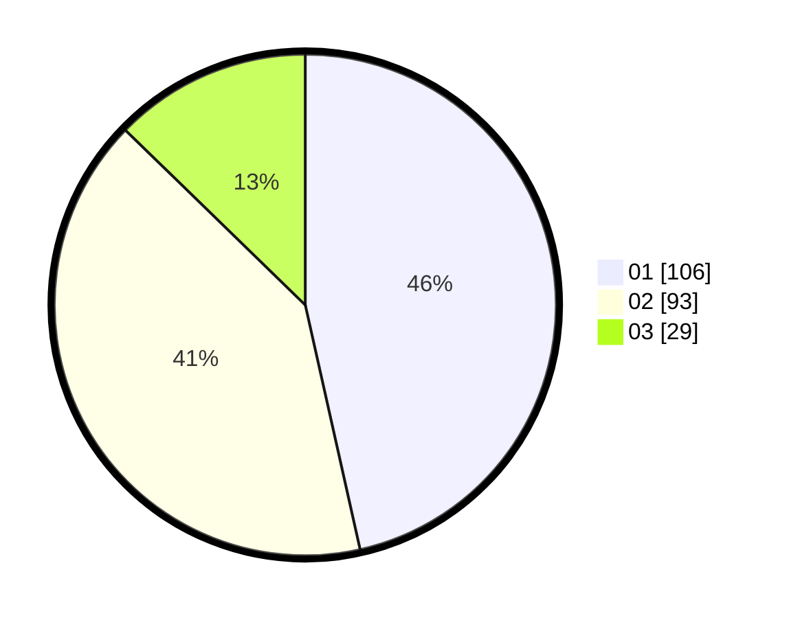

# Hasil

Hasil perolehan suara paslon dapat dilihat pada file paslon-01.txt, paslon-02.txt, dan paslon-03.txt.

Jika tidak ada, artinya data tersebut belum ada pada SIREKAP.

## Perolehan Suara

 * Paslon 01: **106**.
 * Paslon 02: **93**.
 * Paslon 03: **29**.

## Foto C Plano

https://sirekap-obj-formc.kpu.go.id/5f76/pemilu/ppwp/31/71/03/10/03/3171031003074-20240216-181159--a1c68dd3-7188-473e-9e9f-e59e8fde3129.jpg

https://sirekap-obj-formc.kpu.go.id/5f76/pemilu/ppwp/31/71/03/10/03/3171031003074-20240216-181302--cb93696e-bd60-4de8-b28c-3bb2ae754863.jpg

https://sirekap-obj-formc.kpu.go.id/5f76/pemilu/ppwp/31/71/03/10/03/3171031003074-20240216-181502--a93ef2ed-80a6-420d-b7ef-e6740f88eb5e.jpg

## DATA PEMILIH TETAP

Jumlah pemilih dalam DPT: **293**.
 * L: **136**.
 * P: **157**.

## DATA PENGGUNA HAK PILIH

Jumlah pengguna hak pilih dalam DPT: **225**.
 * L: **104**.
 * P: **121**.

Jumlah pengguna hak pilih dalam DPTb: **2**.
 * L: **1**.
 * P: **1**.

Jumlah pengguna hak pilih dalam DPK: **2**.
 * L: **2**.
 * P: **0**.

Jumlah pengguna hak pilih: **229**.
 * L: **107**.
 * P: **122**.

## JUMLAH SUARA SAH DAN TIDAK SAH

JUMLAH SELURUH SUARA SAH: **228**.

JUMLAH SUARA TIDAK SAH: **1**.

JUMLAH SELURUH SUARA SAH DAN SUARA TIDAK SAH: **229**.
