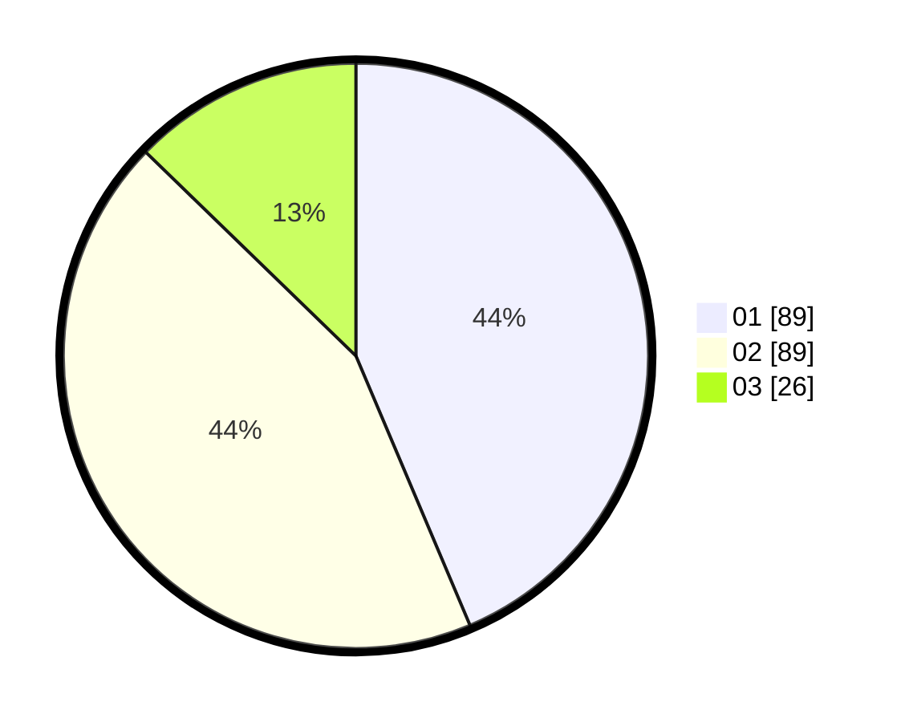

# Hasil

Hasil perolehan suara paslon dapat dilihat pada file paslon-01.txt, paslon-02.txt, dan paslon-03.txt.

Jika tidak ada, artinya data tersebut belum ada pada SIREKAP.

## Perolehan Suara

 * Paslon 01: **89**.
 * Paslon 02: **89**.
 * Paslon 03: **26**.

## Foto C Plano

https://sirekap-obj-formc.kpu.go.id/b8e6/pemilu/ppwp/31/71/03/10/03/3171031003075-20240214-212446--c5037cde-7917-4dcc-844b-8e4903fc4ed1.jpg

https://sirekap-obj-formc.kpu.go.id/b8e6/pemilu/ppwp/31/71/03/10/03/3171031003075-20240214-212637--0dc0759c-3ef0-4331-97a9-4bce7a872df9.jpg

https://sirekap-obj-formc.kpu.go.id/b8e6/pemilu/ppwp/31/71/03/10/03/3171031003075-20240214-212150--af96dcab-c529-4f2a-aa09-b610af28180e.jpg
