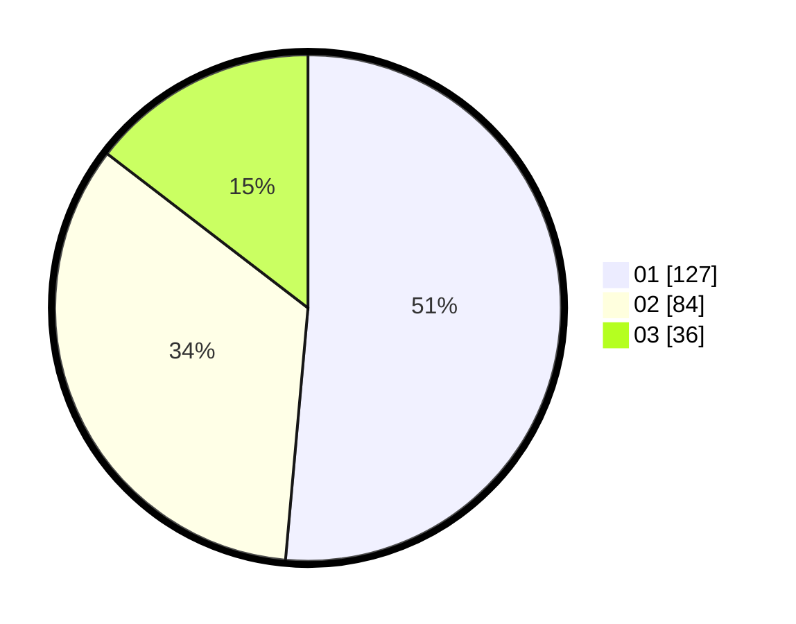

# Hasil

Hasil perolehan suara paslon dapat dilihat pada file paslon-01.txt, paslon-02.txt, dan paslon-03.txt.

Jika tidak ada, artinya data tersebut belum ada pada SIREKAP.

## Perolehan Suara

 * Paslon 01: **127**.
 * Paslon 02: **84**.
 * Paslon 03: **36**.

## Foto C Plano

https://sirekap-obj-formc.kpu.go.id/3424/pemilu/ppwp/31/71/03/10/03/3171031003076-20240216-095244--31e743f9-1ff5-4eb9-9294-c0568bb892d6.jpg

https://sirekap-obj-formc.kpu.go.id/3424/pemilu/ppwp/31/71/03/10/03/3171031003076-20240216-095246--2ac3d2b8-924d-4857-b217-bc139da37179.jpg

https://sirekap-obj-formc.kpu.go.id/3424/pemilu/ppwp/31/71/03/10/03/3171031003076-20240216-095245--4deefa71-8454-48bb-9182-5bfd5f50c7cd.jpg

## DATA PEMILIH TETAP

Jumlah pemilih dalam DPT: **297**.
 * L: **149**.
 * P: **148**.

## DATA PENGGUNA HAK PILIH

Jumlah pengguna hak pilih dalam DPT: **252**.
 * L: **128**.
 * P: **124**.

Jumlah pengguna hak pilih dalam DPTb: **0**.
 * L: **0**.
 * P: **0**.

Jumlah pengguna hak pilih dalam DPK: **2**.
 * L: **1**.
 * P: **1**.

Jumlah pengguna hak pilih: **254**.
 * L: **129**.
 * P: **125**.

## JUMLAH SUARA SAH DAN TIDAK SAH

JUMLAH SELURUH SUARA SAH: **247**.

JUMLAH SUARA TIDAK SAH: **7**.

JUMLAH SELURUH SUARA SAH DAN SUARA TIDAK SAH: **254**.
