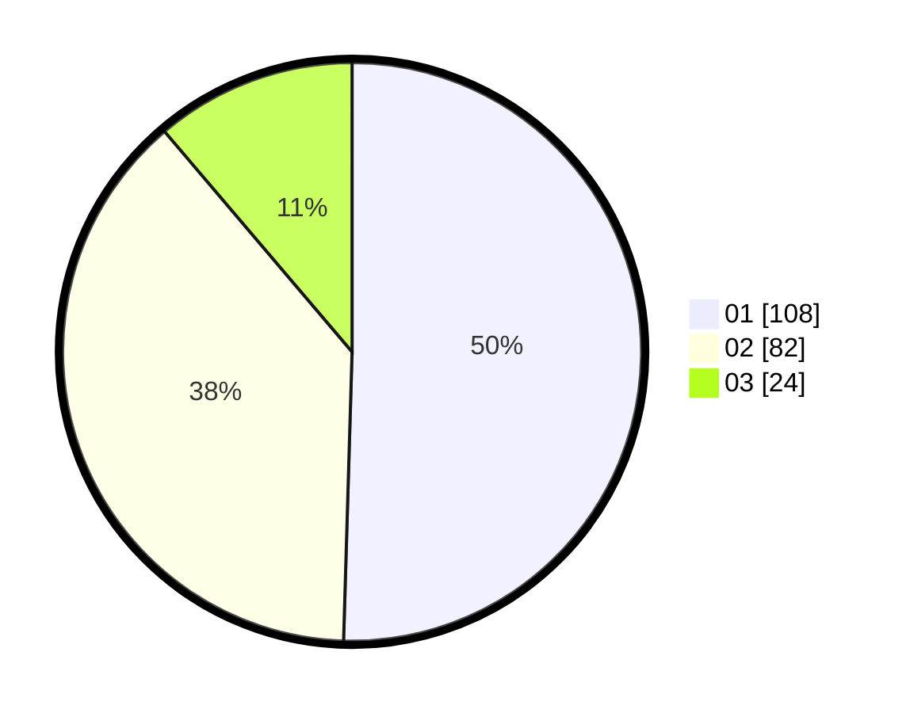

# Hasil

Hasil perolehan suara paslon dapat dilihat pada file paslon-01.txt, paslon-02.txt, dan paslon-03.txt.

Jika tidak ada, artinya data tersebut belum ada pada SIREKAP.

## Perolehan Suara

 * Paslon 01: **108**.
 * Paslon 02: **82**.
 * Paslon 03: **24**.

## Foto C Plano

https://sirekap-obj-formc.kpu.go.id/cb59/pemilu/ppwp/31/71/03/10/04/3171031004001-20240216-202528--21afc727-abc2-4dbf-8fc1-429e9ade947b.jpg

https://sirekap-obj-formc.kpu.go.id/cb59/pemilu/ppwp/31/71/03/10/04/3171031004001-20240214-221812--be6ff775-95d0-4559-90e6-5474c3a985db.jpg

https://sirekap-obj-formc.kpu.go.id/cb59/pemilu/ppwp/31/71/03/10/04/3171031004001-20240214-222038--abc03f0e-ddab-4484-bee3-3eae8b7a9f74.jpg
