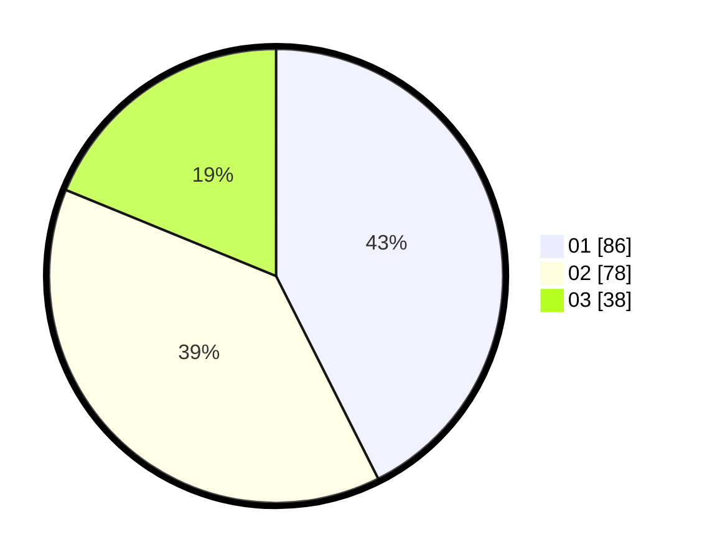

# Hasil

Hasil perolehan suara paslon dapat dilihat pada file paslon-01.txt, paslon-02.txt, dan paslon-03.txt.

Jika tidak ada, artinya data tersebut belum ada pada SIREKAP.

## Perolehan Suara

 * Paslon 01: **86**.
 * Paslon 02: **78**.
 * Paslon 03: **38**.

## Foto C Plano

https://sirekap-obj-formc.kpu.go.id/02a7/pemilu/ppwp/31/71/03/10/04/3171031004006-20240216-155630--bc2ccd44-02e6-4ab1-83c8-fe9fdab4878b.jpg

https://sirekap-obj-formc.kpu.go.id/02a7/pemilu/ppwp/31/71/03/10/04/3171031004006-20240216-155631--1047b132-2e8a-4657-a2c2-0cb04e2ff518.jpg

https://sirekap-obj-formc.kpu.go.id/02a7/pemilu/ppwp/31/71/03/10/04/3171031004006-20240216-155630--761e4f04-4365-412a-9fa8-70eaf8c69613.jpg

## DATA PEMILIH TETAP

Jumlah pemilih dalam DPT: **260**.
 * L: **116**.
 * P: **144**.

## DATA PENGGUNA HAK PILIH

Jumlah pengguna hak pilih dalam DPT: **200**.
 * L: **87**.
 * P: **113**.

Jumlah pengguna hak pilih dalam DPTb: **4**.
 * L: **1**.
 * P: **3**.

Jumlah pengguna hak pilih dalam DPK: **0**.
 * L: **0**.
 * P: **0**.

Jumlah pengguna hak pilih: **204**.
 * L: **88**.
 * P: **116**.

## JUMLAH SUARA SAH DAN TIDAK SAH

JUMLAH SELURUH SUARA SAH: **202**.

JUMLAH SUARA TIDAK SAH: **2**.

JUMLAH SELURUH SUARA SAH DAN SUARA TIDAK SAH: **204**.
