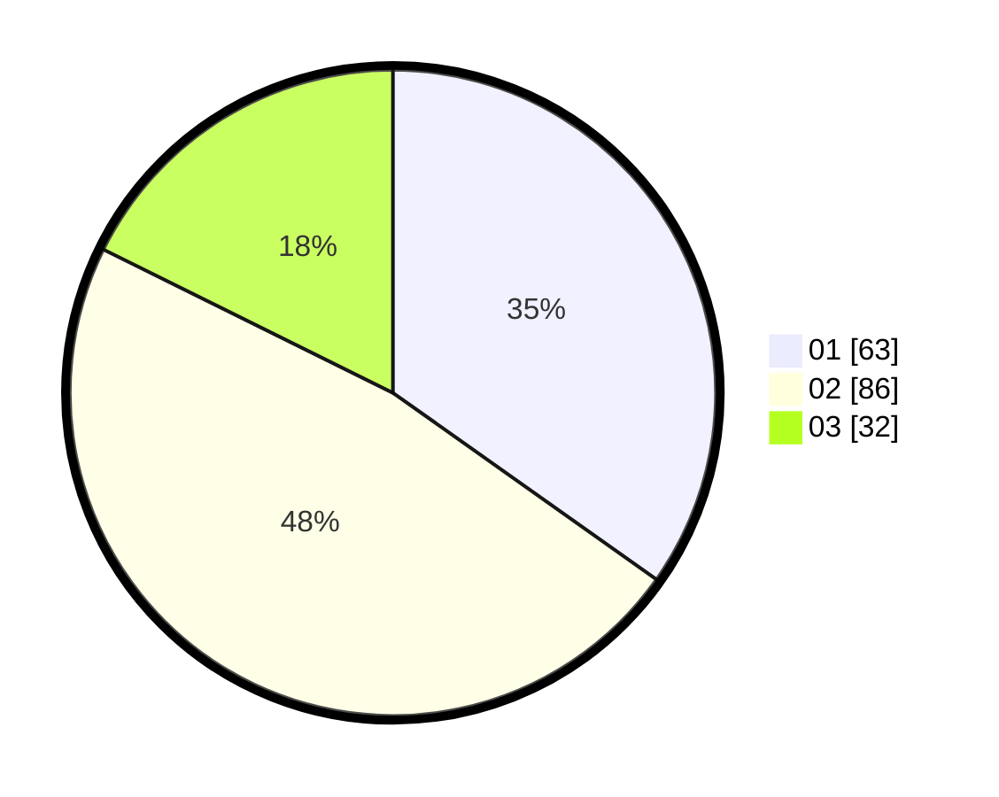

# Hasil

Hasil perolehan suara paslon dapat dilihat pada file paslon-01.txt, paslon-02.txt, dan paslon-03.txt.

Jika tidak ada, artinya data tersebut belum ada pada SIREKAP.

## Perolehan Suara

 * Paslon 01: **63**.
 * Paslon 02: **86**.
 * Paslon 03: **32**.

## Foto C Plano

https://sirekap-obj-formc.kpu.go.id/35f3/pemilu/ppwp/31/71/03/10/04/3171031004008-20240217-094044--6558f173-466e-4542-b0dc-b13206c265f0.jpg

https://sirekap-obj-formc.kpu.go.id/35f3/pemilu/ppwp/31/71/03/10/04/3171031004008-20240217-094045--87ee08cc-87a1-4164-a2e9-058b299d0558.jpg

https://sirekap-obj-formc.kpu.go.id/35f3/pemilu/ppwp/31/71/03/10/04/3171031004008-20240217-094045--bd8a3a67-fdb9-4df7-95b4-83890bcae8b6.jpg

## DATA PEMILIH TETAP

Jumlah pemilih dalam DPT: **259**.
 * L: **131**.
 * P: **128**.

## DATA PENGGUNA HAK PILIH

Jumlah pengguna hak pilih dalam DPT: **187**.
 * L: **91**.
 * P: **96**.

Jumlah pengguna hak pilih dalam DPTb: **0**.
 * L: **0**.
 * P: **0**.

Jumlah pengguna hak pilih dalam DPK: **2**.
 * L: **1**.
 * P: **1**.

Jumlah pengguna hak pilih: **189**.
 * L: **92**.
 * P: **97**.

## JUMLAH SUARA SAH DAN TIDAK SAH

JUMLAH SELURUH SUARA SAH: **181**.

JUMLAH SUARA TIDAK SAH: **8**.

JUMLAH SELURUH SUARA SAH DAN SUARA TIDAK SAH: **189**.
