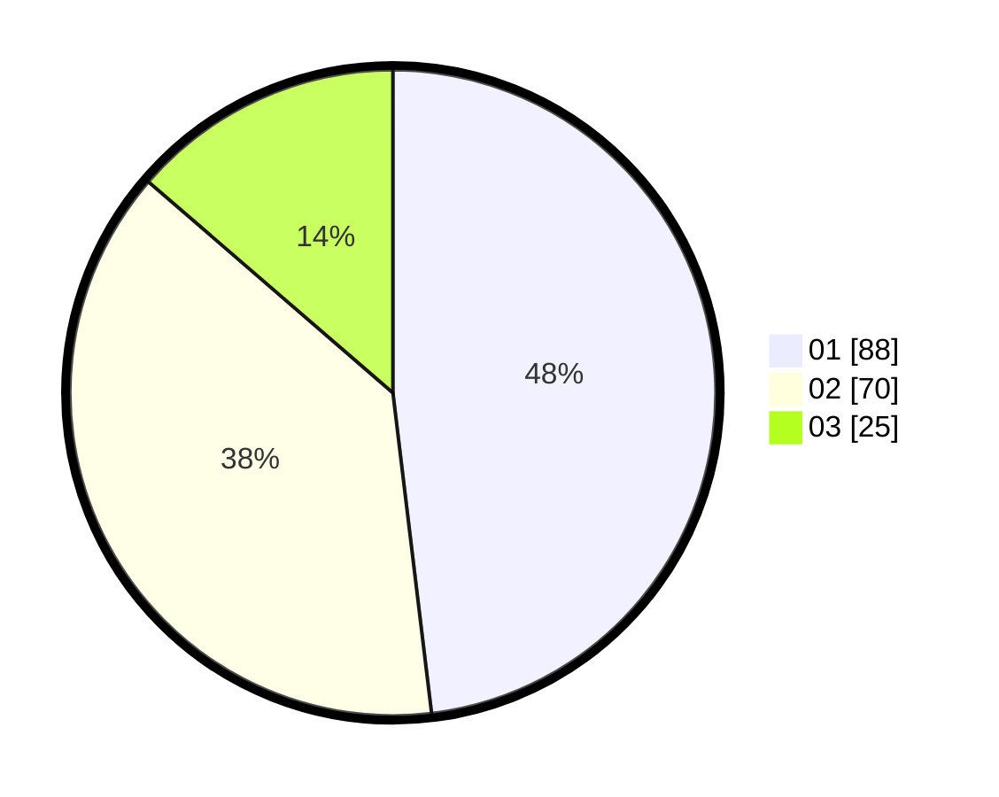

# Hasil

Hasil perolehan suara paslon dapat dilihat pada file paslon-01.txt, paslon-02.txt, dan paslon-03.txt.

Jika tidak ada, artinya data tersebut belum ada pada SIREKAP.

## Perolehan Suara

 * Paslon 01: **88**.
 * Paslon 02: **70**.
 * Paslon 03: **25**.

## Foto C Plano

https://sirekap-obj-formc.kpu.go.id/10fe/pemilu/ppwp/31/71/03/10/04/3171031004010-20240216-015046--2c0903f8-939f-40a5-8522-adcab50269f7.jpg

https://sirekap-obj-formc.kpu.go.id/10fe/pemilu/ppwp/31/71/03/10/04/3171031004010-20240216-015054--1d292660-dc3a-442c-8d75-f4302256349f.jpg

https://sirekap-obj-formc.kpu.go.id/10fe/pemilu/ppwp/31/71/03/10/04/3171031004010-20240214-212036--9fd38e57-5c52-4700-bdf9-bb9446a8637c.jpg

## DATA PEMILIH TETAP

Jumlah pemilih dalam DPT: **256**.
 * L: **124**.
 * P: **132**.

## DATA PENGGUNA HAK PILIH

Jumlah pengguna hak pilih dalam DPT: **186**.
 * L: **86**.
 * P: **100**.

Jumlah pengguna hak pilih dalam DPTb: **2**.
 * L: **1**.
 * P: **1**.

Jumlah pengguna hak pilih dalam DPK: **1**.
 * L: **0**.
 * P: **1**.

Jumlah pengguna hak pilih: **189**.
 * L: **87**.
 * P: **102**.

## JUMLAH SUARA SAH DAN TIDAK SAH

JUMLAH SELURUH SUARA SAH: **183**.

JUMLAH SUARA TIDAK SAH: **6**.

JUMLAH SELURUH SUARA SAH DAN SUARA TIDAK SAH: **189**.
