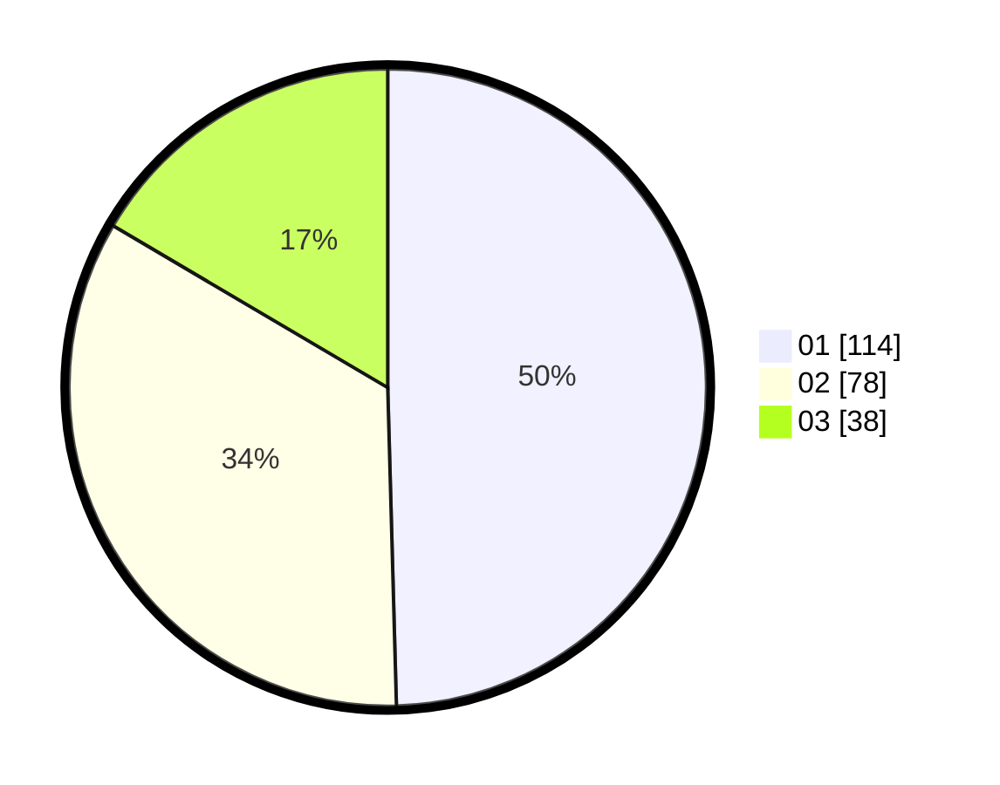

# Hasil

Hasil perolehan suara paslon dapat dilihat pada file paslon-01.txt, paslon-02.txt, dan paslon-03.txt.

Jika tidak ada, artinya data tersebut belum ada pada SIREKAP.

## Perolehan Suara

 * Paslon 01: **114**.
 * Paslon 02: **78**.
 * Paslon 03: **38**.

## Foto C Plano

https://sirekap-obj-formc.kpu.go.id/62c1/pemilu/ppwp/31/71/03/10/04/3171031004011-20240214-213432--a8cce40c-076f-461b-bae5-b4ae6e78e822.jpg

https://sirekap-obj-formc.kpu.go.id/62c1/pemilu/ppwp/31/71/03/10/04/3171031004011-20240214-213032--8bfa5184-e798-420b-9dff-edea53dda653.jpg

https://sirekap-obj-formc.kpu.go.id/62c1/pemilu/ppwp/31/71/03/10/04/3171031004011-20240214-213131--5ed77d17-7e77-46b8-9809-e90cd876b35c.jpg

## DATA PEMILIH TETAP

Jumlah pemilih dalam DPT: **231**.
 * L: **114**.
 * P: **117**.

## DATA PENGGUNA HAK PILIH

Jumlah pengguna hak pilih dalam DPT: **231**.
 * L: **114**.
 * P: **117**.

Jumlah pengguna hak pilih dalam DPTb: **0**.
 * L: **0**.
 * P: **0**.

Jumlah pengguna hak pilih dalam DPK: **0**.
 * L: **0**.
 * P: **0**.

Jumlah pengguna hak pilih: **231**.
 * L: **114**.
 * P: **117**.

## JUMLAH SUARA SAH DAN TIDAK SAH

JUMLAH SELURUH SUARA SAH: **230**.

JUMLAH SUARA TIDAK SAH: **1**.

JUMLAH SELURUH SUARA SAH DAN SUARA TIDAK SAH: **231**.
