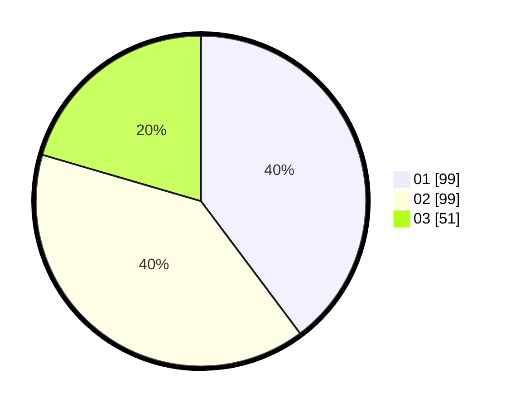

# Hasil

Hasil perolehan suara paslon dapat dilihat pada file paslon-01.txt, paslon-02.txt, dan paslon-03.txt.

Jika tidak ada, artinya data tersebut belum ada pada SIREKAP.

## Perolehan Suara

 * Paslon 01: **99**.
 * Paslon 02: **99**.
 * Paslon 03: **51**.

## Foto C Plano

https://sirekap-obj-formc.kpu.go.id/e0c0/pemilu/ppwp/31/71/03/10/04/3171031004013-20240214-210306--d7b6df7e-bc55-4c6d-a4d2-0d6aea3f6c22.jpg

https://sirekap-obj-formc.kpu.go.id/e0c0/pemilu/ppwp/31/71/03/10/04/3171031004013-20240214-210421--67dea66c-3d14-49ca-8143-de052296115a.jpg

https://sirekap-obj-formc.kpu.go.id/e0c0/pemilu/ppwp/31/71/03/10/04/3171031004013-20240214-210545--e50f6a86-053a-4173-86d2-49bb344d36d6.jpg

## DATA PEMILIH TETAP

Jumlah pemilih dalam DPT: **290**.
 * L: **132**.
 * P: **158**.

## DATA PENGGUNA HAK PILIH

Jumlah pengguna hak pilih dalam DPT: **238**.
 * L: **101**.
 * P: **137**.

Jumlah pengguna hak pilih dalam DPTb: **2**.
 * L: **1**.
 * P: **1**.

Jumlah pengguna hak pilih dalam DPK: **10**.
 * L: **6**.
 * P: **4**.

Jumlah pengguna hak pilih: **250**.
 * L: **108**.
 * P: **142**.

## JUMLAH SUARA SAH DAN TIDAK SAH

JUMLAH SELURUH SUARA SAH: **249**.

JUMLAH SUARA TIDAK SAH: **1**.

JUMLAH SELURUH SUARA SAH DAN SUARA TIDAK SAH: **250**.
