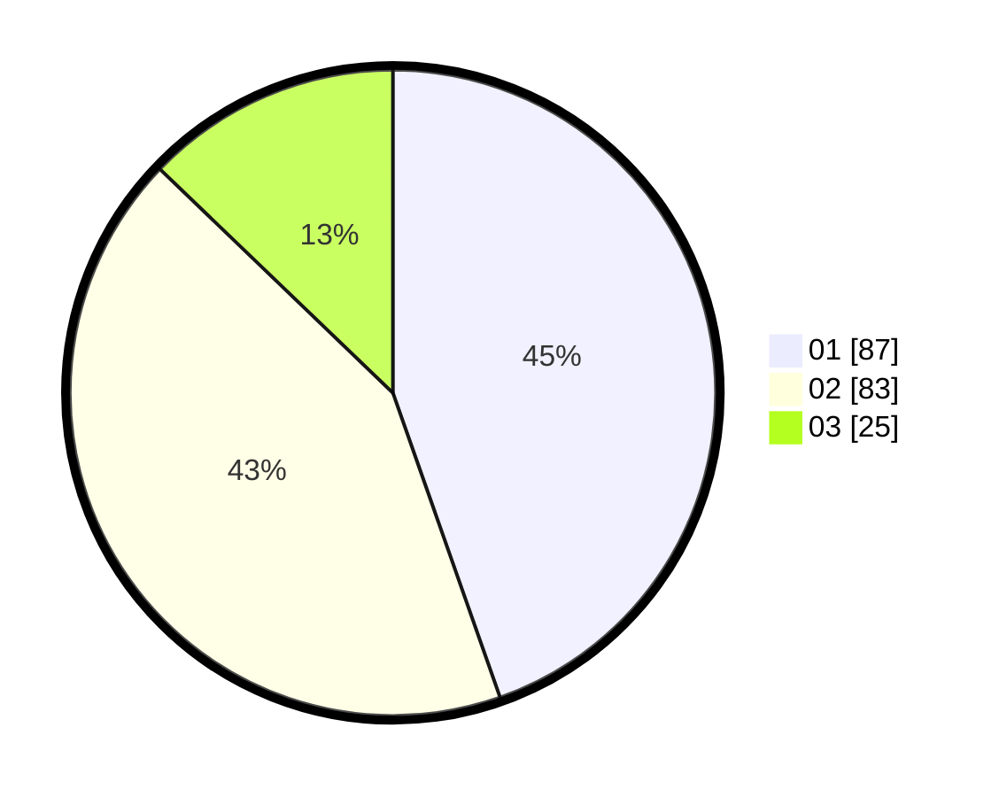

# Hasil

Hasil perolehan suara paslon dapat dilihat pada file paslon-01.txt, paslon-02.txt, dan paslon-03.txt.

Jika tidak ada, artinya data tersebut belum ada pada SIREKAP.

## Perolehan Suara

 * Paslon 01: **87**.
 * Paslon 02: **83**.
 * Paslon 03: **25**.

## Foto C Plano

https://sirekap-obj-formc.kpu.go.id/032f/pemilu/ppwp/31/71/03/10/04/3171031004016-20240216-004952--1d4d3643-fa1a-4915-9a38-ac7c2ea45580.jpg

https://sirekap-obj-formc.kpu.go.id/032f/pemilu/ppwp/31/71/03/10/04/3171031004016-20240216-004953--d7ddaf10-c66d-4174-a929-ae0b0a016154.jpg

https://sirekap-obj-formc.kpu.go.id/032f/pemilu/ppwp/31/71/03/10/04/3171031004016-20240216-004952--a0db6a88-1135-49f5-930f-37395288403a.jpg

## DATA PEMILIH TETAP

Jumlah pemilih dalam DPT: **198**.
 * L: **98**.
 * P: **100**.

## DATA PENGGUNA HAK PILIH

Jumlah pengguna hak pilih dalam DPT: **196**.
 * L: **96**.
 * P: **100**.

Jumlah pengguna hak pilih dalam DPTb: **1**.
 * L: **1**.
 * P: **0**.

Jumlah pengguna hak pilih dalam DPK: **1**.
 * L: **1**.
 * P: **0**.

Jumlah pengguna hak pilih: **198**.
 * L: **98**.
 * P: **100**.

## JUMLAH SUARA SAH DAN TIDAK SAH

JUMLAH SELURUH SUARA SAH: **195**.

JUMLAH SUARA TIDAK SAH: **3**.

JUMLAH SELURUH SUARA SAH DAN SUARA TIDAK SAH: **198**.
