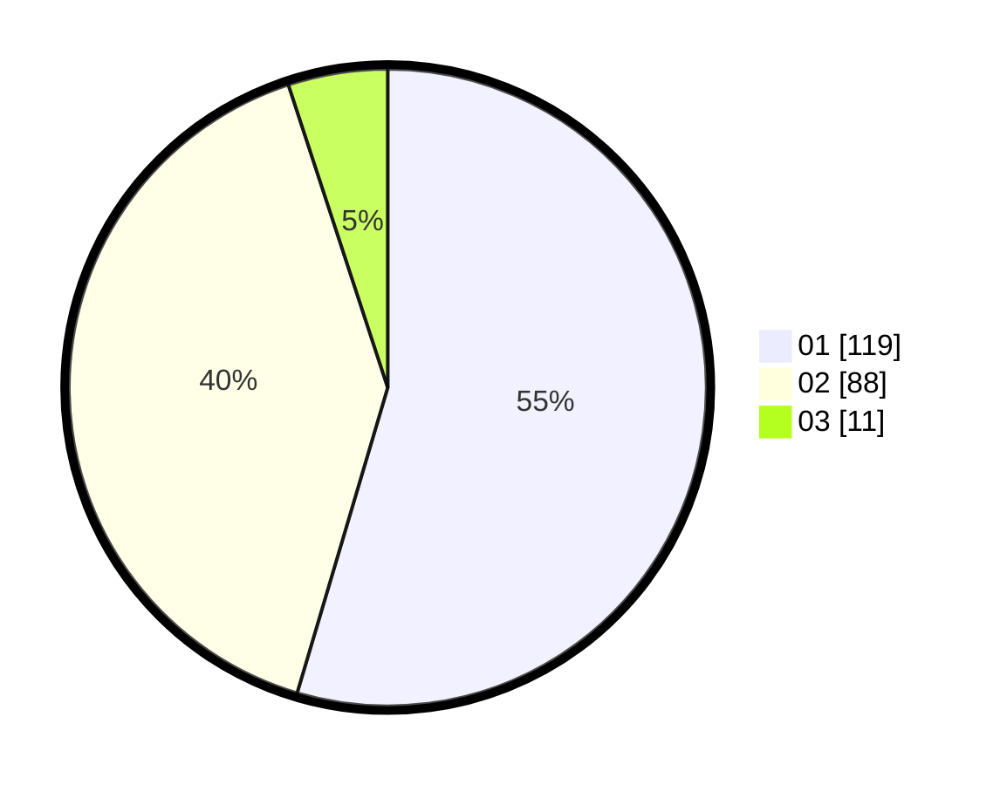

# Hasil

Hasil perolehan suara paslon dapat dilihat pada file paslon-01.txt, paslon-02.txt, dan paslon-03.txt.

Jika tidak ada, artinya data tersebut belum ada pada SIREKAP.

## Perolehan Suara

 * Paslon 01: **119**.
 * Paslon 02: **88**.
 * Paslon 03: **11**.

## Foto C Plano

https://sirekap-obj-formc.kpu.go.id/f2c1/pemilu/ppwp/31/71/03/10/04/3171031004018-20240214-194711--5f7966b9-d570-4964-87f3-03da262d4d00.jpg

https://sirekap-obj-formc.kpu.go.id/f2c1/pemilu/ppwp/31/71/03/10/04/3171031004018-20240214-201855--fea54647-4351-4cb0-a143-d9e837a68a71.jpg

https://sirekap-obj-formc.kpu.go.id/f2c1/pemilu/ppwp/31/71/03/10/04/3171031004018-20240214-201624--a2a309a4-a9cb-440d-b195-e481b870b61f.jpg

## DATA PEMILIH TETAP

Jumlah pemilih dalam DPT: **279**.
 * L: **139**.
 * P: **140**.

## DATA PENGGUNA HAK PILIH

Jumlah pengguna hak pilih dalam DPT: **214**.
 * L: **102**.
 * P: **112**.

Jumlah pengguna hak pilih dalam DPTb: **2**.
 * L: **2**.
 * P: **0**.

Jumlah pengguna hak pilih dalam DPK: **6**.
 * L: **4**.
 * P: **2**.

Jumlah pengguna hak pilih: **222**.
 * L: **108**.
 * P: **114**.

## JUMLAH SUARA SAH DAN TIDAK SAH

JUMLAH SELURUH SUARA SAH: **218**.

JUMLAH SUARA TIDAK SAH: **4**.

JUMLAH SELURUH SUARA SAH DAN SUARA TIDAK SAH: **222**.
