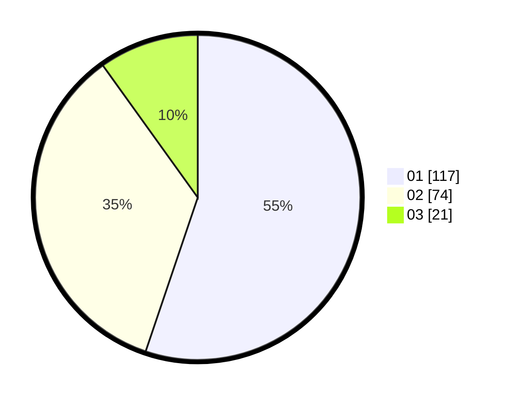

# Hasil

Hasil perolehan suara paslon dapat dilihat pada file paslon-01.txt, paslon-02.txt, dan paslon-03.txt.

Jika tidak ada, artinya data tersebut belum ada pada SIREKAP.

## Perolehan Suara

 * Paslon 01: **117**.
 * Paslon 02: **74**.
 * Paslon 03: **21**.

## Foto C Plano

https://sirekap-obj-formc.kpu.go.id/2ce4/pemilu/ppwp/31/71/03/10/04/3171031004019-20240215-005632--0e26b9f8-8002-4996-9a9c-7b78eceb21b2.jpg

https://sirekap-obj-formc.kpu.go.id/2ce4/pemilu/ppwp/31/71/03/10/04/3171031004019-20240214-200713--d6eb7caa-b4b3-4147-a9d6-f6ab369a5ee1.jpg

https://sirekap-obj-formc.kpu.go.id/2ce4/pemilu/ppwp/31/71/03/10/04/3171031004019-20240214-200810--8530eb98-6da3-48ad-84b8-6e381a5b1ad2.jpg

## DATA PEMILIH TETAP

Jumlah pemilih dalam DPT: **283**.
 * L: **137**.
 * P: **146**.

## DATA PENGGUNA HAK PILIH

Jumlah pengguna hak pilih dalam DPT: **217**.
 * L: **103**.
 * P: **114**.

Jumlah pengguna hak pilih dalam DPTb: **2**.
 * L: **1**.
 * P: **1**.

Jumlah pengguna hak pilih dalam DPK: **1**.
 * L: **0**.
 * P: **1**.

Jumlah pengguna hak pilih: **220**.
 * L: **104**.
 * P: **116**.

## JUMLAH SUARA SAH DAN TIDAK SAH

JUMLAH SELURUH SUARA SAH: **212**.

JUMLAH SUARA TIDAK SAH: **5**.

JUMLAH SELURUH SUARA SAH DAN SUARA TIDAK SAH: **217**.
