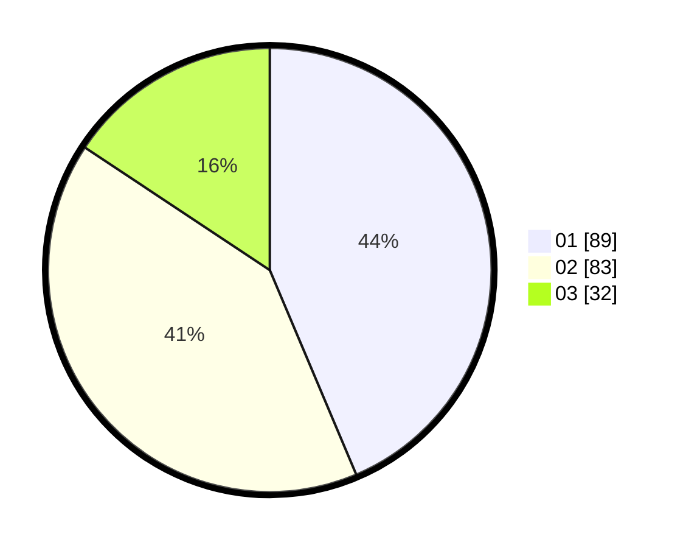

# Hasil

Hasil perolehan suara paslon dapat dilihat pada file paslon-01.txt, paslon-02.txt, dan paslon-03.txt.

Jika tidak ada, artinya data tersebut belum ada pada SIREKAP.

## Perolehan Suara

 * Paslon 01: **89**.
 * Paslon 02: **83**.
 * Paslon 03: **32**.

## Foto C Plano

https://sirekap-obj-formc.kpu.go.id/13f6/pemilu/ppwp/31/71/03/10/04/3171031004020-20240214-191754--eeb130d3-4a84-4239-a750-00633672d143.jpg

https://sirekap-obj-formc.kpu.go.id/13f6/pemilu/ppwp/31/71/03/10/04/3171031004020-20240214-191840--1e94c06e-c835-4c59-95dd-0589e3a467e3.jpg

https://sirekap-obj-formc.kpu.go.id/13f6/pemilu/ppwp/31/71/03/10/04/3171031004020-20240214-191925--f873fe87-59ea-4d17-a0e7-4feec7411a19.jpg

## DATA PEMILIH TETAP

Jumlah pemilih dalam DPT: **277**.
 * L: **125**.
 * P: **152**.

## DATA PENGGUNA HAK PILIH

Jumlah pengguna hak pilih dalam DPT: **200**.
 * L: **95**.
 * P: **105**.

Jumlah pengguna hak pilih dalam DPTb: **1**.
 * L: **0**.
 * P: **1**.

Jumlah pengguna hak pilih dalam DPK: **6**.
 * L: **3**.
 * P: **3**.

Jumlah pengguna hak pilih: **207**.
 * L: **98**.
 * P: **109**.

## JUMLAH SUARA SAH DAN TIDAK SAH

JUMLAH SELURUH SUARA SAH: **204**.

JUMLAH SUARA TIDAK SAH: **3**.

JUMLAH SELURUH SUARA SAH DAN SUARA TIDAK SAH: **207**.
