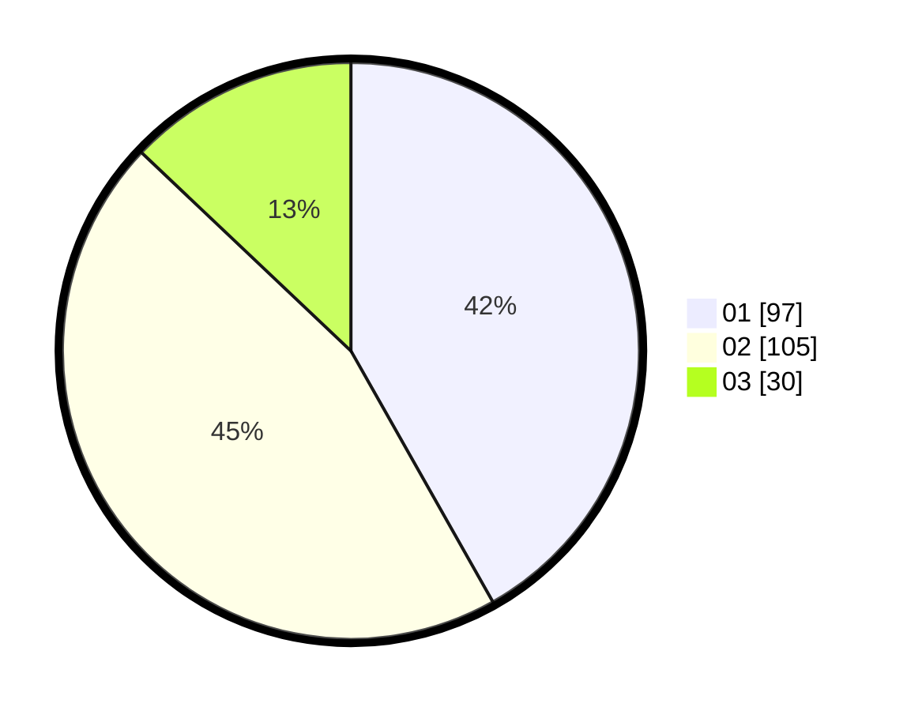

# Hasil

Hasil perolehan suara paslon dapat dilihat pada file paslon-01.txt, paslon-02.txt, dan paslon-03.txt.

Jika tidak ada, artinya data tersebut belum ada pada SIREKAP.

## Perolehan Suara

 * Paslon 01: **97**.
 * Paslon 02: **105**.
 * Paslon 03: **30**.

## Foto C Plano

https://sirekap-obj-formc.kpu.go.id/da7a/pemilu/ppwp/31/71/03/10/04/3171031004025-20240214-223103--b4c31a5c-e7c2-486a-ac38-b92a487e8bff.jpg

https://sirekap-obj-formc.kpu.go.id/da7a/pemilu/ppwp/31/71/03/10/04/3171031004025-20240214-202424--c1fbe0b9-6d2e-4c7c-b6fd-23f630691f37.jpg

https://sirekap-obj-formc.kpu.go.id/da7a/pemilu/ppwp/31/71/03/10/04/3171031004025-20240214-202625--1721a5ef-e312-4da3-b76e-7e137209ead2.jpg
