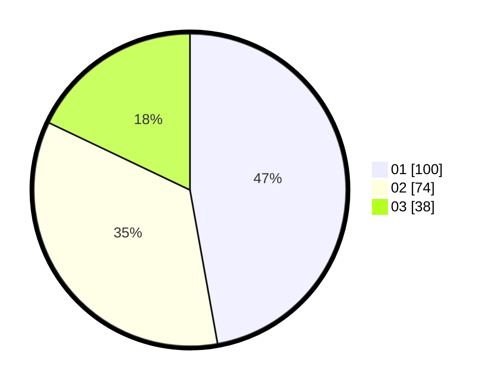

# Hasil

Hasil perolehan suara paslon dapat dilihat pada file paslon-01.txt, paslon-02.txt, dan paslon-03.txt.

Jika tidak ada, artinya data tersebut belum ada pada SIREKAP.

## Perolehan Suara

 * Paslon 01: **100**.
 * Paslon 02: **74**.
 * Paslon 03: **38**.

## Foto C Plano

https://sirekap-obj-formc.kpu.go.id/4fe5/pemilu/ppwp/31/71/03/10/04/3171031004027-20240214-192947--1dbe3028-10bc-45a3-b00b-15213b6c0298.jpg

https://sirekap-obj-formc.kpu.go.id/4fe5/pemilu/ppwp/31/71/03/10/04/3171031004027-20240214-191632--c9ed8e28-600f-47d5-83d0-bb50dae65a55.jpg

https://sirekap-obj-formc.kpu.go.id/4fe5/pemilu/ppwp/31/71/03/10/04/3171031004027-20240214-194025--5d5fded6-50fa-43b9-aa78-0f3e81a62751.jpg

## DATA PEMILIH TETAP

Jumlah pemilih dalam DPT: **281**.
 * L: **135**.
 * P: **146**.

## DATA PENGGUNA HAK PILIH

Jumlah pengguna hak pilih dalam DPT: **211**.
 * L: **99**.
 * P: **112**.

Jumlah pengguna hak pilih dalam DPTb: **4**.
 * L: **1**.
 * P: **3**.

Jumlah pengguna hak pilih dalam DPK: **0**.
 * L: **0**.
 * P: **0**.

Jumlah pengguna hak pilih: **215**.
 * L: **100**.
 * P: **115**.

## JUMLAH SUARA SAH DAN TIDAK SAH

JUMLAH SELURUH SUARA SAH: **212**.

JUMLAH SUARA TIDAK SAH: **3**.

JUMLAH SELURUH SUARA SAH DAN SUARA TIDAK SAH: **215**.
