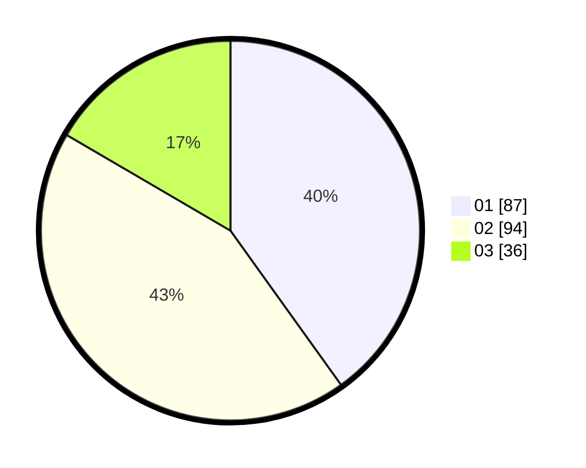

# Hasil

Hasil perolehan suara paslon dapat dilihat pada file paslon-01.txt, paslon-02.txt, dan paslon-03.txt.

Jika tidak ada, artinya data tersebut belum ada pada SIREKAP.

## Perolehan Suara

 * Paslon 01: **87**.
 * Paslon 02: **94**.
 * Paslon 03: **36**.

## Foto C Plano

https://sirekap-obj-formc.kpu.go.id/e155/pemilu/ppwp/31/71/03/10/04/3171031004028-20240214-201416--2626d5c4-bb15-4517-b414-fd6da61c07c4.jpg

https://sirekap-obj-formc.kpu.go.id/e155/pemilu/ppwp/31/71/03/10/04/3171031004028-20240214-202148--360a1eed-5078-40fe-9747-7dc6d4025bd4.jpg

https://sirekap-obj-formc.kpu.go.id/e155/pemilu/ppwp/31/71/03/10/04/3171031004028-20240214-202326--e916e50c-bb13-4f86-a910-505dc7dce225.jpg

## DATA PEMILIH TETAP

Jumlah pemilih dalam DPT: **272**.
 * L: **121**.
 * P: **151**.

## DATA PENGGUNA HAK PILIH

Jumlah pengguna hak pilih dalam DPT: **216**.
 * L: **94**.
 * P: **122**.

Jumlah pengguna hak pilih dalam DPTb: **4**.
 * L: **1**.
 * P: **3**.

Jumlah pengguna hak pilih dalam DPK: **0**.
 * L: **0**.
 * P: **0**.

Jumlah pengguna hak pilih: **220**.
 * L: **95**.
 * P: **125**.

## JUMLAH SUARA SAH DAN TIDAK SAH

JUMLAH SELURUH SUARA SAH: **217**.

JUMLAH SUARA TIDAK SAH: **3**.

JUMLAH SELURUH SUARA SAH DAN SUARA TIDAK SAH: **220**.
