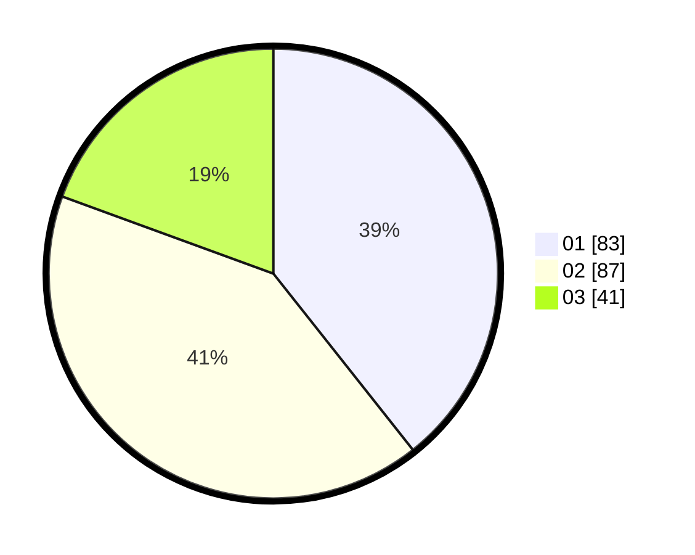

# Hasil

Hasil perolehan suara paslon dapat dilihat pada file paslon-01.txt, paslon-02.txt, dan paslon-03.txt.

Jika tidak ada, artinya data tersebut belum ada pada SIREKAP.

## Perolehan Suara

 * Paslon 01: **83**.
 * Paslon 02: **87**.
 * Paslon 03: **41**.

## Foto C Plano

https://sirekap-obj-formc.kpu.go.id/372e/pemilu/ppwp/31/71/03/10/04/3171031004029-20240216-154120--789d8e89-a42d-458a-9b87-743bae74d783.jpg

https://sirekap-obj-formc.kpu.go.id/372e/pemilu/ppwp/31/71/03/10/04/3171031004029-20240216-154121--15035fb6-a222-4708-9d6b-69c77655a800.jpg

https://sirekap-obj-formc.kpu.go.id/372e/pemilu/ppwp/31/71/03/10/04/3171031004029-20240216-154120--f026d2a9-400f-4ad0-9486-06355271ad55.jpg

## DATA PEMILIH TETAP

Jumlah pemilih dalam DPT: **275**.
 * L: **134**.
 * P: **141**.

## DATA PENGGUNA HAK PILIH

Jumlah pengguna hak pilih dalam DPT: **211**.
 * L: **97**.
 * P: **114**.

Jumlah pengguna hak pilih dalam DPTb: **2**.
 * L: **1**.
 * P: **1**.

Jumlah pengguna hak pilih dalam DPK: **0**.
 * L: **0**.
 * P: **0**.

Jumlah pengguna hak pilih: **213**.
 * L: **98**.
 * P: **115**.

## JUMLAH SUARA SAH DAN TIDAK SAH

JUMLAH SELURUH SUARA SAH: **211**.

JUMLAH SUARA TIDAK SAH: **2**.

JUMLAH SELURUH SUARA SAH DAN SUARA TIDAK SAH: **213**.
