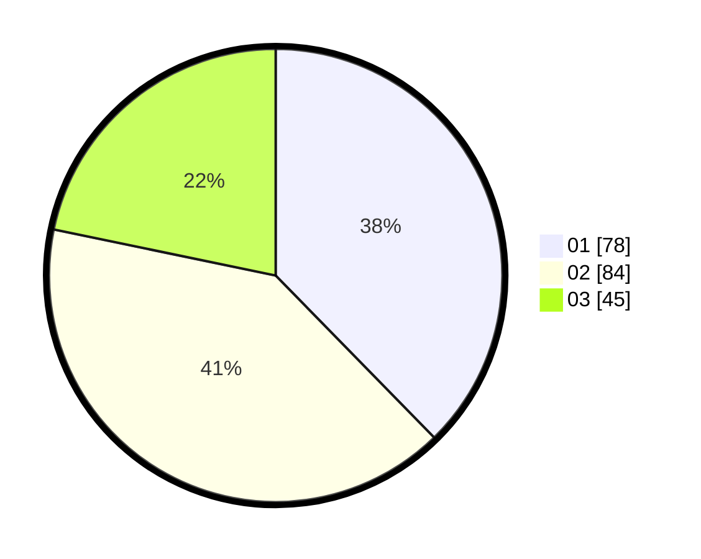

# Hasil

Hasil perolehan suara paslon dapat dilihat pada file paslon-01.txt, paslon-02.txt, dan paslon-03.txt.

Jika tidak ada, artinya data tersebut belum ada pada SIREKAP.

## Perolehan Suara

 * Paslon 01: **78**.
 * Paslon 02: **84**.
 * Paslon 03: **45**.

## Foto C Plano

https://sirekap-obj-formc.kpu.go.id/3c39/pemilu/ppwp/31/71/03/10/04/3171031004030-20240216-152855--b5fe7a5a-0506-443b-8022-7f01bcf2c4c4.jpg

https://sirekap-obj-formc.kpu.go.id/3c39/pemilu/ppwp/31/71/03/10/04/3171031004030-20240216-152856--0bae42ad-fd8f-4eb7-a90e-f5f3c3075957.jpg

https://sirekap-obj-formc.kpu.go.id/3c39/pemilu/ppwp/31/71/03/10/04/3171031004030-20240216-152856--8b1aa182-7fce-4b3f-97d7-137e1ee1f562.jpg

## DATA PEMILIH TETAP

Jumlah pemilih dalam DPT: **268**.
 * L: **135**.
 * P: **133**.

## DATA PENGGUNA HAK PILIH

Jumlah pengguna hak pilih dalam DPT: **205**.
 * L: **102**.
 * P: **103**.

Jumlah pengguna hak pilih dalam DPTb: **5**.
 * L: **2**.
 * P: **3**.

Jumlah pengguna hak pilih dalam DPK: **0**.
 * L: **0**.
 * P: **0**.

Jumlah pengguna hak pilih: **210**.
 * L: **104**.
 * P: **106**.

## JUMLAH SUARA SAH DAN TIDAK SAH

JUMLAH SELURUH SUARA SAH: **207**.

JUMLAH SUARA TIDAK SAH: **3**.

JUMLAH SELURUH SUARA SAH DAN SUARA TIDAK SAH: **210**.
