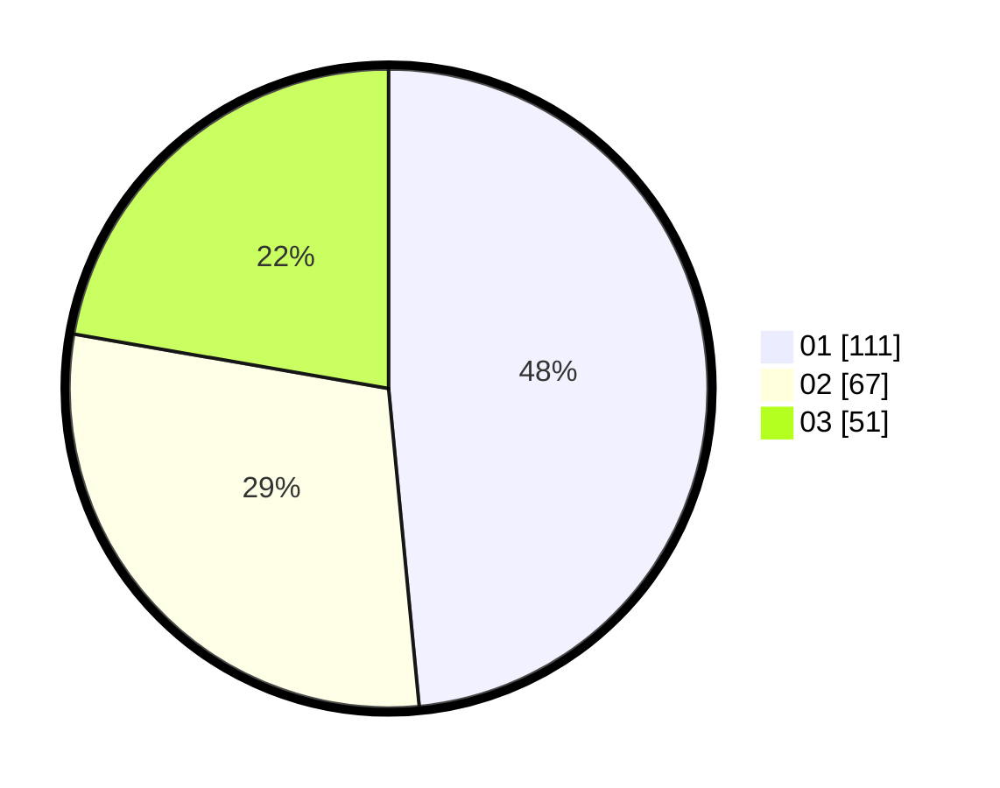

# Hasil

Hasil perolehan suara paslon dapat dilihat pada file paslon-01.txt, paslon-02.txt, dan paslon-03.txt.

Jika tidak ada, artinya data tersebut belum ada pada SIREKAP.

## Perolehan Suara

 * Paslon 01: **111**.
 * Paslon 02: **67**.
 * Paslon 03: **51**.

## Foto C Plano

https://sirekap-obj-formc.kpu.go.id/cecc/pemilu/ppwp/31/71/03/10/04/3171031004033-20240214-155043--f62ec17c-7ce5-4173-b5d4-400fefe4b5e4.jpg

https://sirekap-obj-formc.kpu.go.id/cecc/pemilu/ppwp/31/71/03/10/04/3171031004033-20240214-185112--8571827b-7c56-4421-bb17-0adf4541a69b.jpg

https://sirekap-obj-formc.kpu.go.id/cecc/pemilu/ppwp/31/71/03/10/04/3171031004033-20240215-230814--b2deec86-9b09-486f-963e-f959b6a40bfa.jpg

## DATA PEMILIH TETAP

Jumlah pemilih dalam DPT: **273**.
 * L: **133**.
 * P: **140**.

## DATA PENGGUNA HAK PILIH

Jumlah pengguna hak pilih dalam DPT: **229**.
 * L: **105**.
 * P: **124**.

Jumlah pengguna hak pilih dalam DPTb: **2**.
 * L: **2**.
 * P: **0**.

Jumlah pengguna hak pilih dalam DPK: **0**.
 * L: **0**.
 * P: **0**.

Jumlah pengguna hak pilih: **231**.
 * L: **107**.
 * P: **124**.

## JUMLAH SUARA SAH DAN TIDAK SAH

JUMLAH SELURUH SUARA SAH: **229**.

JUMLAH SUARA TIDAK SAH: **2**.

JUMLAH SELURUH SUARA SAH DAN SUARA TIDAK SAH: **231**.
