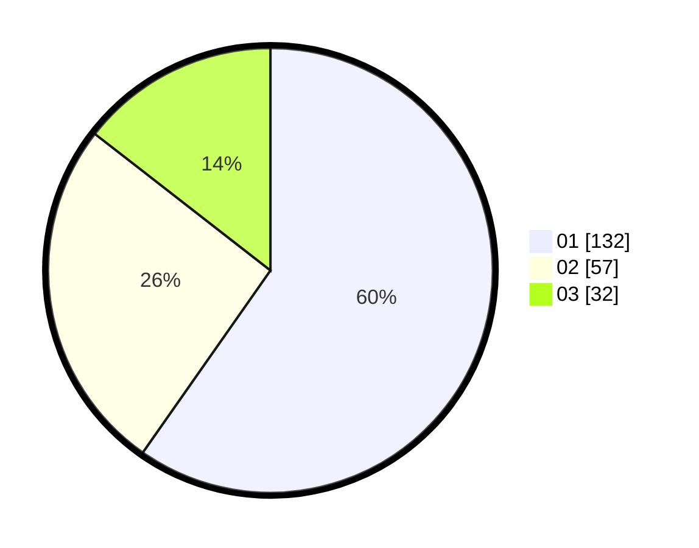

# Hasil

Hasil perolehan suara paslon dapat dilihat pada file paslon-01.txt, paslon-02.txt, dan paslon-03.txt.

Jika tidak ada, artinya data tersebut belum ada pada SIREKAP.

## Perolehan Suara

 * Paslon 01: **132**.
 * Paslon 02: **57**.
 * Paslon 03: **32**.

## Foto C Plano

https://sirekap-obj-formc.kpu.go.id/b3c5/pemilu/ppwp/31/71/03/10/04/3171031004052-20240214-193719--bb39c7e9-140f-4c85-950e-095f7fbccec6.jpg

https://sirekap-obj-formc.kpu.go.id/b3c5/pemilu/ppwp/31/71/03/10/04/3171031004052-20240214-193828--91410d83-f356-4a90-80f5-89103183a789.jpg

https://sirekap-obj-formc.kpu.go.id/b3c5/pemilu/ppwp/31/71/03/10/04/3171031004052-20240214-193925--61628d34-b2ab-435a-a446-85505119c432.jpg

## DATA PEMILIH TETAP

Jumlah pemilih dalam DPT: **280**.
 * L: **138**.
 * P: **142**.

## DATA PENGGUNA HAK PILIH

Jumlah pengguna hak pilih dalam DPT: **225**.
 * L: **105**.
 * P: **120**.

Jumlah pengguna hak pilih dalam DPTb: **0**.
 * L: **0**.
 * P: **0**.

Jumlah pengguna hak pilih dalam DPK: **0**.
 * L: **0**.
 * P: **0**.

Jumlah pengguna hak pilih: **225**.
 * L: **105**.
 * P: **120**.

## JUMLAH SUARA SAH DAN TIDAK SAH

JUMLAH SELURUH SUARA SAH: **221**.

JUMLAH SUARA TIDAK SAH: **4**.

JUMLAH SELURUH SUARA SAH DAN SUARA TIDAK SAH: **225**.
