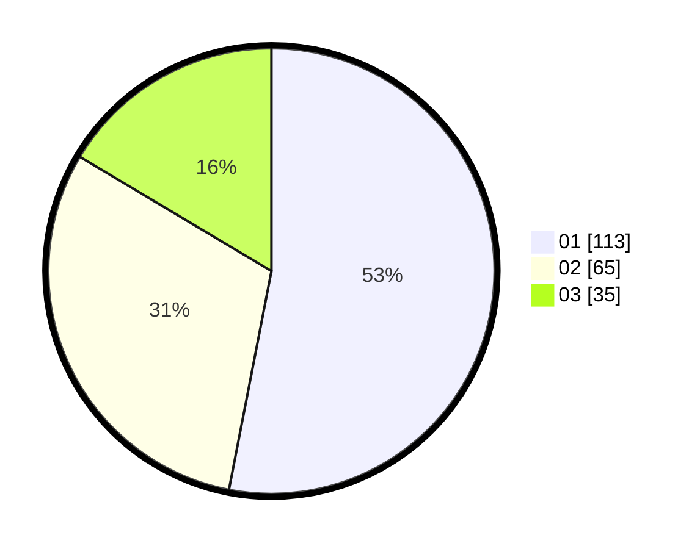

# Hasil

Hasil perolehan suara paslon dapat dilihat pada file paslon-01.txt, paslon-02.txt, dan paslon-03.txt.

Jika tidak ada, artinya data tersebut belum ada pada SIREKAP.

## Perolehan Suara

 * Paslon 01: **113**.
 * Paslon 02: **65**.
 * Paslon 03: **35**.

## Foto C Plano

https://sirekap-obj-formc.kpu.go.id/ce2b/pemilu/ppwp/31/71/03/10/04/3171031004054-20240216-001300--63a1041f-db17-4fa2-aacb-e7f4aa382bc9.jpg

https://sirekap-obj-formc.kpu.go.id/ce2b/pemilu/ppwp/31/71/03/10/04/3171031004054-20240216-001302--b05dae9d-8e71-45c9-adc0-6ad8daf6c002.jpg

https://sirekap-obj-formc.kpu.go.id/ce2b/pemilu/ppwp/31/71/03/10/04/3171031004054-20240216-001301--977fbce8-5bc8-411d-ba82-3e96e8c9bfa6.jpg

## DATA PEMILIH TETAP

Jumlah pemilih dalam DPT: **276**.
 * L: **128**.
 * P: **148**.

## DATA PENGGUNA HAK PILIH

Jumlah pengguna hak pilih dalam DPT: **211**.
 * L: **96**.
 * P: **115**.

Jumlah pengguna hak pilih dalam DPTb: **3**.
 * L: **1**.
 * P: **2**.

Jumlah pengguna hak pilih dalam DPK: **2**.
 * L: **1**.
 * P: **1**.

Jumlah pengguna hak pilih: **216**.
 * L: **98**.
 * P: **118**.

## JUMLAH SUARA SAH DAN TIDAK SAH

JUMLAH SELURUH SUARA SAH: **213**.

JUMLAH SUARA TIDAK SAH: **3**.

JUMLAH SELURUH SUARA SAH DAN SUARA TIDAK SAH: **216**.
