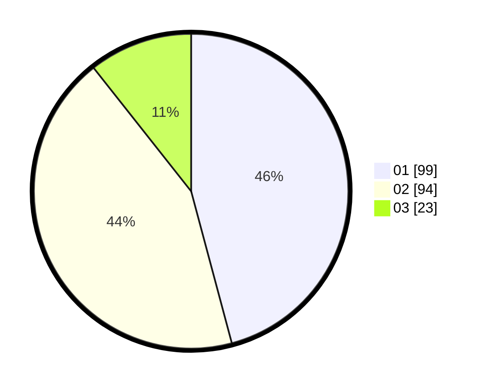

# Hasil

Hasil perolehan suara paslon dapat dilihat pada file paslon-01.txt, paslon-02.txt, dan paslon-03.txt.

Jika tidak ada, artinya data tersebut belum ada pada SIREKAP.

## Perolehan Suara

 * Paslon 01: **99**.
 * Paslon 02: **94**.
 * Paslon 03: **23**.

## Foto C Plano

https://sirekap-obj-formc.kpu.go.id/97fe/pemilu/ppwp/31/71/03/10/04/3171031004056-20240215-222503--e6acd6f8-419a-4a85-806f-6ec2683fda9a.jpg

https://sirekap-obj-formc.kpu.go.id/97fe/pemilu/ppwp/31/71/03/10/04/3171031004056-20240215-222505--8f876a08-2569-40a8-9f07-77e546c6fd1f.jpg

https://sirekap-obj-formc.kpu.go.id/97fe/pemilu/ppwp/31/71/03/10/04/3171031004056-20240215-222504--37abc16d-0e07-4f8b-86ef-2237f2d10c51.jpg

## DATA PEMILIH TETAP

Jumlah pemilih dalam DPT: **279**.
 * L: **146**.
 * P: **133**.

## DATA PENGGUNA HAK PILIH

Jumlah pengguna hak pilih dalam DPT: **216**.
 * L: **108**.
 * P: **108**.

Jumlah pengguna hak pilih dalam DPTb: **0**.
 * L: **0**.
 * P: **0**.

Jumlah pengguna hak pilih dalam DPK: **4**.
 * L: **1**.
 * P: **3**.

Jumlah pengguna hak pilih: **220**.
 * L: **109**.
 * P: **111**.

## JUMLAH SUARA SAH DAN TIDAK SAH

JUMLAH SELURUH SUARA SAH: **216**.

JUMLAH SUARA TIDAK SAH: **4**.

JUMLAH SELURUH SUARA SAH DAN SUARA TIDAK SAH: **220**.
