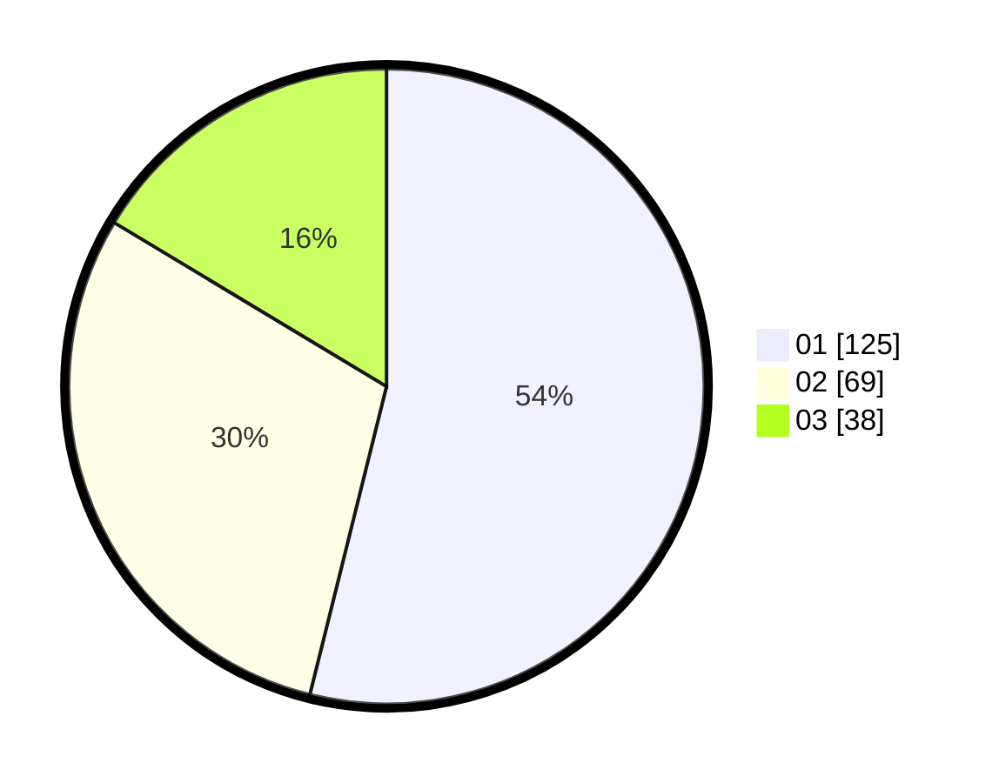

# Hasil

Hasil perolehan suara paslon dapat dilihat pada file paslon-01.txt, paslon-02.txt, dan paslon-03.txt.

Jika tidak ada, artinya data tersebut belum ada pada SIREKAP.

## Perolehan Suara

 * Paslon 01: **125**.
 * Paslon 02: **69**.
 * Paslon 03: **38**.

## Foto C Plano

https://sirekap-obj-formc.kpu.go.id/8bb6/pemilu/ppwp/31/71/03/10/04/3171031004057-20240215-220047--418b481d-2494-4149-8bab-3a9aa2c33096.jpg

https://sirekap-obj-formc.kpu.go.id/8bb6/pemilu/ppwp/31/71/03/10/04/3171031004057-20240215-220051--d10f59f7-a829-411c-8165-50096881e0d8.jpg

https://sirekap-obj-formc.kpu.go.id/8bb6/pemilu/ppwp/31/71/03/10/04/3171031004057-20240215-220050--32847543-d89d-4c40-9913-9b8c6b0711a1.jpg

## DATA PEMILIH TETAP

Jumlah pemilih dalam DPT: **291**.
 * L: **133**.
 * P: **158**.

## DATA PENGGUNA HAK PILIH

Jumlah pengguna hak pilih dalam DPT: **232**.
 * L: **101**.
 * P: **131**.

Jumlah pengguna hak pilih dalam DPTb: **3**.
 * L: **1**.
 * P: **2**.

Jumlah pengguna hak pilih dalam DPK: **2**.
 * L: **1**.
 * P: **1**.

Jumlah pengguna hak pilih: **237**.
 * L: **103**.
 * P: **134**.

## JUMLAH SUARA SAH DAN TIDAK SAH

JUMLAH SELURUH SUARA SAH: **232**.

JUMLAH SUARA TIDAK SAH: **5**.

JUMLAH SELURUH SUARA SAH DAN SUARA TIDAK SAH: **237**.
