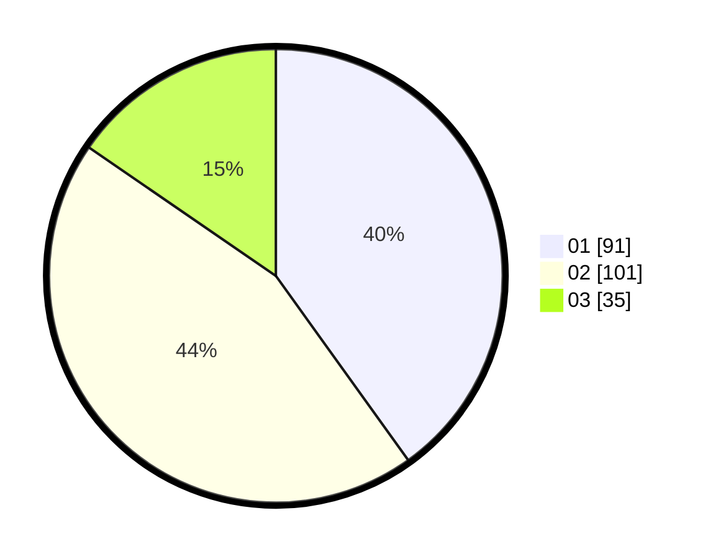

# Hasil

Hasil perolehan suara paslon dapat dilihat pada file paslon-01.txt, paslon-02.txt, dan paslon-03.txt.

Jika tidak ada, artinya data tersebut belum ada pada SIREKAP.

## Perolehan Suara

 * Paslon 01: **91**.
 * Paslon 02: **101**.
 * Paslon 03: **35**.

## Foto C Plano

https://sirekap-obj-formc.kpu.go.id/ebb1/pemilu/ppwp/31/71/03/10/04/3171031004058-20240214-190807--f8cab68a-620d-4353-8df9-af3b523d0c13.jpg

https://sirekap-obj-formc.kpu.go.id/ebb1/pemilu/ppwp/31/71/03/10/04/3171031004058-20240214-191002--5ee9b19e-6e5c-467b-934e-4b637c117ef0.jpg

https://sirekap-obj-formc.kpu.go.id/ebb1/pemilu/ppwp/31/71/03/10/04/3171031004058-20240214-191123--07cab2f7-402f-4a8f-8db7-a3631303e441.jpg

## DATA PEMILIH TETAP

Jumlah pemilih dalam DPT: **288**.
 * L: **144**.
 * P: **144**.

## DATA PENGGUNA HAK PILIH

Jumlah pengguna hak pilih dalam DPT: **231**.
 * L: **114**.
 * P: **117**.

Jumlah pengguna hak pilih dalam DPTb: **0**.
 * L: **0**.
 * P: **0**.

Jumlah pengguna hak pilih dalam DPK: **0**.
 * L: **0**.
 * P: **0**.

Jumlah pengguna hak pilih: **231**.
 * L: **114**.
 * P: **117**.

## JUMLAH SUARA SAH DAN TIDAK SAH

JUMLAH SELURUH SUARA SAH: **227**.

JUMLAH SUARA TIDAK SAH: **4**.

JUMLAH SELURUH SUARA SAH DAN SUARA TIDAK SAH: **231**.
