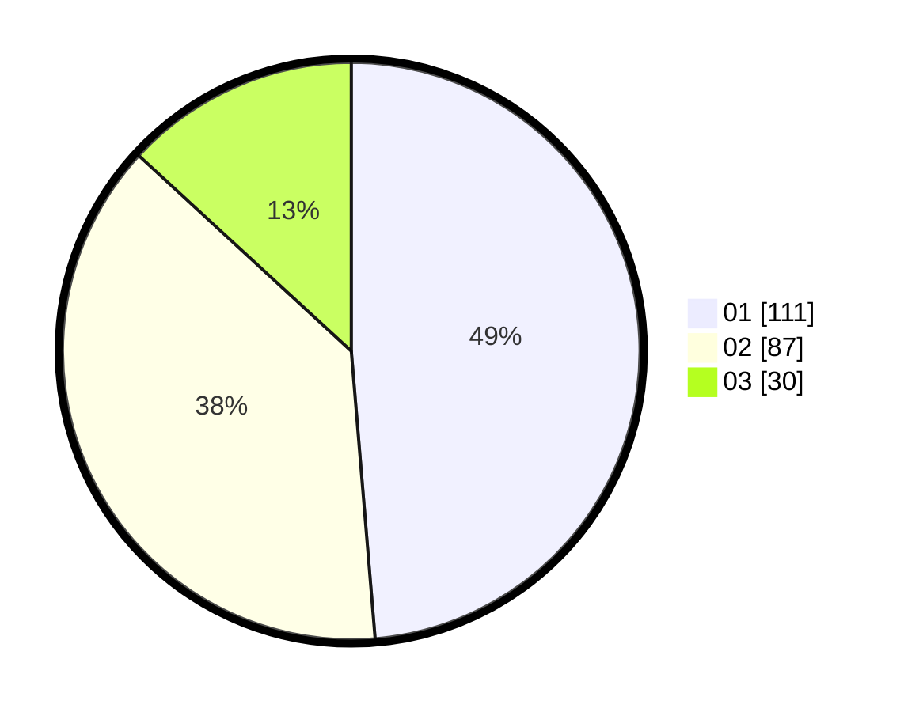

# Hasil

Hasil perolehan suara paslon dapat dilihat pada file paslon-01.txt, paslon-02.txt, dan paslon-03.txt.

Jika tidak ada, artinya data tersebut belum ada pada SIREKAP.

## Perolehan Suara

 * Paslon 01: **111**.
 * Paslon 02: **87**.
 * Paslon 03: **30**.

## Foto C Plano

https://sirekap-obj-formc.kpu.go.id/ac37/pemilu/ppwp/31/71/03/10/04/3171031004059-20240217-165512--14ad3ebd-3c41-415d-a908-fae324eccc32.jpg

https://sirekap-obj-formc.kpu.go.id/ac37/pemilu/ppwp/31/71/03/10/04/3171031004059-20240217-165514--7afb4a56-8e55-407f-bb29-a157db46ebf5.jpg

https://sirekap-obj-formc.kpu.go.id/ac37/pemilu/ppwp/31/71/03/10/04/3171031004059-20240217-165513--4d8b02a9-f10c-4038-a037-54d86b2c5f11.jpg

## DATA PEMILIH TETAP

Jumlah pemilih dalam DPT: **231**.
 * L: **109**.
 * P: **122**.

## DATA PENGGUNA HAK PILIH

Jumlah pengguna hak pilih dalam DPT: **280**.
 * L: **136**.
 * P: **144**.

Jumlah pengguna hak pilih dalam DPTb: **0**.
 * L: **0**.
 * P: **0**.

Jumlah pengguna hak pilih dalam DPK: **0**.
 * L: **0**.
 * P: **0**.

Jumlah pengguna hak pilih: **280**.
 * L: **136**.
 * P: **144**.

## JUMLAH SUARA SAH DAN TIDAK SAH

JUMLAH SELURUH SUARA SAH: **228**.

JUMLAH SUARA TIDAK SAH: **3**.

JUMLAH SELURUH SUARA SAH DAN SUARA TIDAK SAH: **231**.
