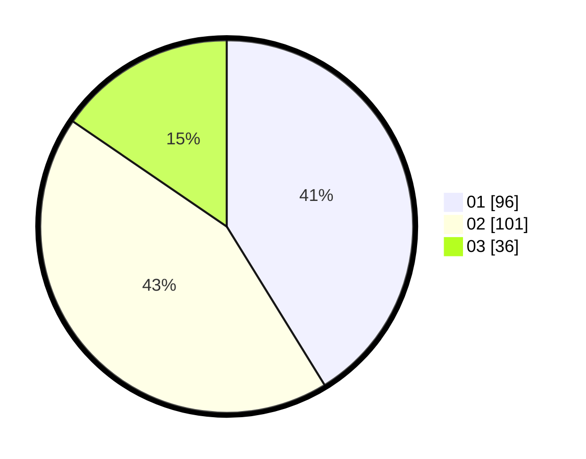

# Hasil

Hasil perolehan suara paslon dapat dilihat pada file paslon-01.txt, paslon-02.txt, dan paslon-03.txt.

Jika tidak ada, artinya data tersebut belum ada pada SIREKAP.

## Perolehan Suara

 * Paslon 01: **96**.
 * Paslon 02: **101**.
 * Paslon 03: **36**.

## Foto C Plano

https://sirekap-obj-formc.kpu.go.id/93dd/pemilu/ppwp/31/71/03/10/04/3171031004061-20240214-213629--3eb4284b-a4df-463f-9810-f82f11c082ea.jpg

https://sirekap-obj-formc.kpu.go.id/93dd/pemilu/ppwp/31/71/03/10/04/3171031004061-20240214-214059--7a3bbaae-6d61-46bd-8a89-eb344f9bcd37.jpg

https://sirekap-obj-formc.kpu.go.id/93dd/pemilu/ppwp/31/71/03/10/04/3171031004061-20240214-214239--2a9c0b98-8237-4d71-81ca-c16570604ffa.jpg
