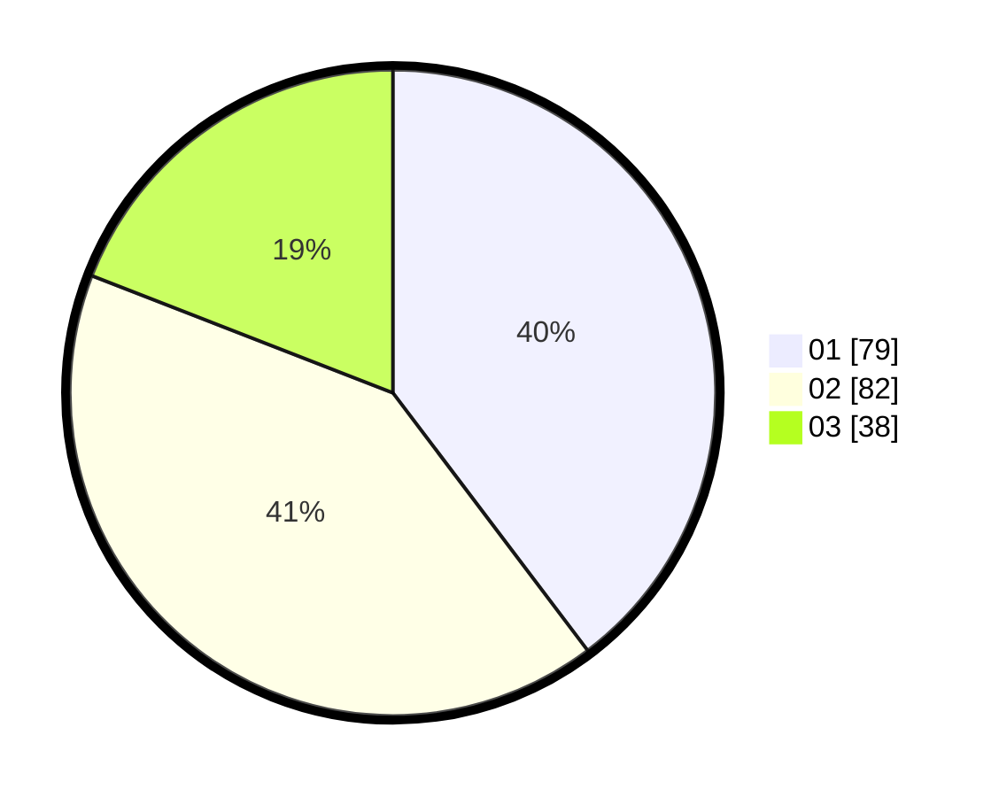

# Hasil

Hasil perolehan suara paslon dapat dilihat pada file paslon-01.txt, paslon-02.txt, dan paslon-03.txt.

Jika tidak ada, artinya data tersebut belum ada pada SIREKAP.

## Perolehan Suara

 * Paslon 01: **79**.
 * Paslon 02: **82**.
 * Paslon 03: **38**.

## Foto C Plano

https://sirekap-obj-formc.kpu.go.id/d8f7/pemilu/ppwp/31/71/03/10/04/3171031004064-20240215-170133--901937c4-6fe1-4625-8ce2-9d31b06b1547.jpg

https://sirekap-obj-formc.kpu.go.id/d8f7/pemilu/ppwp/31/71/03/10/04/3171031004064-20240215-170150--518259bd-f7ce-4fd7-961a-8efb09fbb816.jpg

https://sirekap-obj-formc.kpu.go.id/d8f7/pemilu/ppwp/31/71/03/10/04/3171031004064-20240215-170205--7a4e651b-e3ca-49f4-9a0d-c796ccce6a49.jpg
